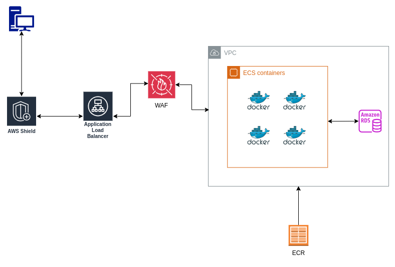

# Parte 1 

En este tutorial vamos a crear un proyecto con una arquitectura de  microservicios, el cual va a estar compuesto por dos servicios (users, products) desarrollado con Golang,  estos van a estar desplegados y ejecutados en el servicio ECS (Elastic Container Service) con un Load balancer como punto de acceso para los usuarios.

Estos son los servicios de AWS que vamos a utilizar.

- ECR (Elastic Container Registry) - Repositorio privado de imágenes docker.
- ECS (Elastic Container Service) - Servicio de imágenes de contenedores.
- Load Balancer - Balanceador de carga para distribuir el tráfico entre los .servicios
- RDS - Servicio de base de datos relacional.
- WAF - Firewall de aplicaciones web.


### DIAGRAMA



En general la cantidad de servicios que tienen un proyecto puede ser  mayor, pero para mantener el tutorial simple vamos a utilizar solo dos servicios.

Capítulos

- Parte 1 - Creación de servicios users y products,  deploy en ECR.
- Parte 2 - Creación de load balancer, target groups, security groups.
- Parte 3 - Creación de servicios ECS, actualización de servicios, pruebas de stress tests, autoscaling
- Parte 4 - Configuración dominio,  https, load balancer setup, WAF firewall
- Parte 5 - Creación de Bases de datos RDS, conexión desde servicios
- Parte 6 - Creación de pipeline CI/CD, pruebas de integración, despliegue automático.


## Crear micro-servicio users 

Para crear el servicio users, primero vamos a crear una carpeta en nuestra máquina.

```sh
$ mkdir -p services/users
```
En la carpeta services/users agregar los siguientes archivos necesarios para crear un proyecto en Golang.

go.mod

```go
module service-users

go 1.22.3

require (
	github.com/go-chi/chi/v5 v5.1.0 // indirect
	github.com/joho/godotenv v1.5.1 // indirect
)
```

En este archivo definimos la version de Go (si en su entorno tienen instalada otra version modificar el valor) que vamos a utilizar para compilar el servicio y las dependecias a utilizar
en este caso son las siguiente:
- **go-chi:** router http el cual nos facilita la creación de endpoints, middlewares, etc.
- **godotenv:** librería que nos permite definir variables de entorno en un archivo .env.

main.go

```go
package main

import (
	"log"
	"net/http"

	"github.com/go-chi/chi/v5"
	"github.com/go-chi/chi/v5/middleware"
	"github.com/joho/godotenv"
)

func main() {

	err := godotenv.Load()
	if err != nil {
		log.Fatal("Error loading .env file")
	}

	r := chi.NewRouter()
	r.Use(middleware.Logger)
	r.Get("/", func(w http.ResponseWriter, r *http.Request) {
		w.Write([]byte("service users API version " + os.Getenv("API_VERSION")))
	})
	http.ListenAndServe(":3000", r)
}
```
En la función main hacemos una llamada a godotenv.Load() para cargar las variables de entorno definidas en un archivo ".env"
En caso de encontrar un error al cargar el archivo se termina la ejecución del programa mostrando un mensaje de error.

Después iniciamos un router de go-chi y definimos un endpoint en la raíz del servidor el cual va a mostrar la versión de la API.


.env

```
API_VERSION=1.0.0
```

En este archivo al momento solo definimos la versión de la API,  más adelante vamos a agregar más valores como podría ser los 
valores de conexión a una base de datos.


Dockerfile

```Dockerfile
# syntax=docker/dockerfile:1

FROM golang:1.22 AS build-stage

WORKDIR /app

COPY go.mod go.sum ./
RUN go mod download

COPY . ./

RUN CGO_ENABLED=0 GOOS=linux go build -o /service

FROM gcr.io/distroless/base-debian11 AS build-release-stage

WORKDIR /

COPY --from=build-stage /service /service
COPY .env ./

EXPOSE 3000


ENTRYPOINT ["/service"]
```

En este archivo Dockerfile vamos utilizar un concepto llamado multi-stage build,  el cual nos permite utilizar una imagen base para compilar el servicio ( golang 1.22) copiar los archivos necesarios, descargar dependencias y finalmente crear un binario.

La segunda imagen (gcr.io/distroless/base-debian11) es la que se va a utilizar en ECS para ejecutar nuestro servicio,  esta es una imagen minimalista que solo contiene lo necesario para ejecutar el binario, el cual tenemos que copiar desde el output obtenido del build previo, además necesitamos copiar el .env y exponer el puerto 3000 , finalmente definimos como proceso de entrada el binario ./service.


Para probar esto debemos ejecutar los siguientes comandos en una terminal
```sh
docker build  -f Dockerfile-go -t service-users:v0.0.1 .
docker run --rm -p 3000:3000 service-users:v0.0.1
```

En otra terminal probar la conexión.

```sh
curl http://localhost:3000
```


## Crear usuario IAM credenciales

Para poder subir nuestra imagen a ECR necesitamos un usuario en AWS con los permisos correspondientes.

En el dashboard de nuestra cuenta de AWS ir a esta sección.


**IAM -> Administracion de usuarios -> Usuarios -> Agregar usuario**


- **Nombre:** ecs-lb-tutorial.
- **Opciones de permisos:** Adjuntar políticas directamente.
- **Políticas de permisos:** Agregar "AmazonEC2ContainerRegistryFullAccess"
- **Crear usuario**

### Crear access key

Necesitamos un "Access" y "Private key" para poder comunicarnos a los servicios de AWS usando la terminal (CLI), para esto debemos ir al detalle del usuario creado anteriormente

**Administracion de usuarios -> Usuarios.**

Ir a tab Credenciales de seguridad -> Crear clave de acceso - 
en casos de usos seleccionar Otros, click en Siguiente -> Crear clave de acceso,  finalmente copiar en un lugar seguro la clave de acceso y el secret key, ya que no se va poder acceder al secreto posteriormente.


## Crear ECR repositorio

La región que vamos a utilizar es Virginia, teniendo en cuenta que todos los servicios que vamos a utilizar en AWS tienen que estar en la misma región para que puedan conectarse entre sí.

Para poder subir nuestras imágenes a AWS necesitamos un repositorio en ECR, para esto debemos ir a la consola de AWS y buscar por ECR.


**Ir a seccion -> Private registry -> Repositorios -> Crear repositorio**

- **Nombre del repositorio:** service-users.
- **Etiquetas de imagen:**: Inmutable,  esto es para evitar que se suban imágenes con el mismo tag y que cada nuevo deploy tenga un nuevo tag.

Dejamos las demas opciones en default y click en Crear repositorio.


#### Instalacion CLI aws
Necesitamos tener instalado en nuestra máquina la herramienta CLI de AWS,  sigue las instrucciones de acuerdo a tu sistema operativo en el siguiente link.

https://docs.aws.amazon.com/cli/latest/userguide/getting-started-install.html 

Una vez instalado la CLI de aws, debemos utilizar las credenciales de acceso que creamos anteriormente para configurar la herramienta,  para esto ejecutamos el siguiente comando en una terminal.


```sh
aws configure
```
Debemos utilizar las credenciales (access key, private key) creadas en el paso anterior y como región default seleccionar "us-east-1" (Virginia).

### Subir imagen a ECR

En la carpeta docker/users agregar un archivo llamado deploy.sh con el siguiente contenido.

deploy.sh
```sh
#!/bin/bash

if [ $# -ne 3 ]; then
    echo "Usage: deploy.sh <registry_name> <image_name> <region>"
    exit 1
fi

REGISTRY_URI=$1
REGISTRY_NAME=$2
REGION=$3

aws ecr get-login-password --region $REGION | docker login --username AWS --password-stdin $REGISTRY_URI

docker build -t $IMAGE_NAME .

docker tag $IMAGE_NAME $REGISTRY_URI/$REGISTRY_NAME

docker push $REGISTRY_URI/$REGISTRY_NAME
```

Este script recibe tres argumentos.
- URI del repositorio
- Nombre del repositorio
- Región de aws

Después de validar si existen los argumentos necesarios, obtenemos las credenciales de acceso a ECR y mediante un pipe de linux usamos ese valor en el comando docker login.

Paso seguido construimos la imagen con el tag correspondiente y la subimos a ECR.


Previo a ejecutar el script debemos darle permisos de ejecución.


```sh
chmod +x deploy.sh
```

Para subir la imagen a ECR ejecutamos el siguiente comando, modificando los valores correspondientes generados en su cuenta de AWS, el valor URI del repositorio se encuentra en el dashboard de ECR.

```sh
./deploy.sh 666.dkr.ecr.us-west-2.amazonaws.com service-user:v0.0.1 us-west-1
```

Si todo salió correctamente deberíamos ver la versión de la imagen en el dashboard de ECR.

## Servicio products

Debido a que el contenido del servicio products es prácticamente igual al de users ( solo va a cambiar el contenido del archivo main.go) vamos a ejecutar un comando para hacer una copia de la carpeta users y modificar los archivos necesarios.

```sh
cp -ra services/users services/products
```

Y modificamos la respuesta del endpoint en el archivo services/products/main.go

```go
r.Get("/", func(w http.ResponseWriter, r *http.Request) {
	w.Write([]byte("service products API version " + os.Getenv("API_VERSION")))
})
```

De igual manera que en el servicio users, para products debemos crear un nuevo repositorio privado en ECR con el nombre service-products y posteriormente realizar un deploy con el script deploy.sh
```sh
./deploy.sh <registry-uri> <registry-name> <region>  
```

Si todo salio correctamente deberíamos poder ver las imágenes en el dashboard de ECR.


Link a parte 2

