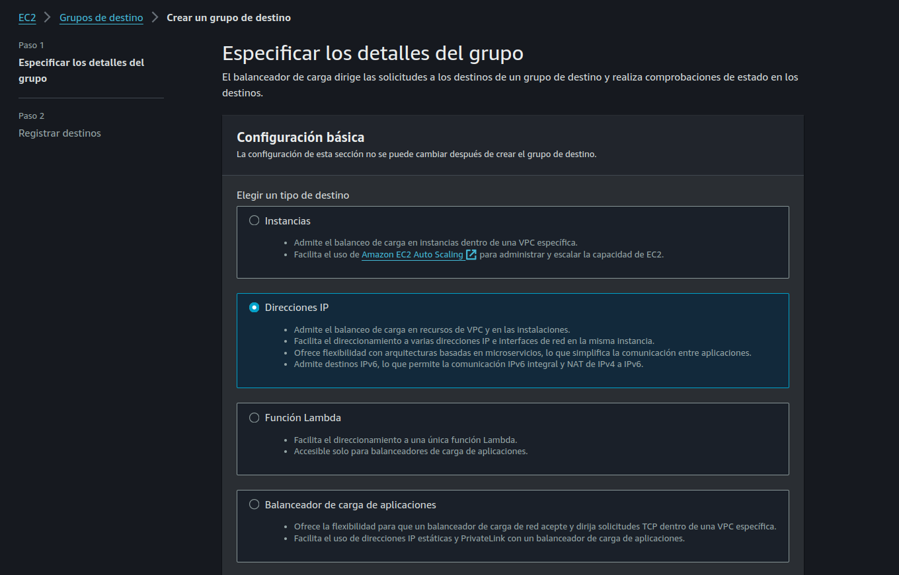

# PARTE 2 

## Creación de load balancer

En esta parte del tutorial vamos a ver el proceso de creación de un load balancer con todos los servicios asociados, como security groups, target groups, etc.

Glosario.

- Creación de security groups
- Creación de target groups
- Creación de load balancer

## Creación de security groups

> Un security group es un firewall que controla el trafico de entrada y salida el cual se puede asociar a un instancia de AWS.

El primer security group que vamos a crear va a estar asociado al load balancer y es el que va a permitir el trafico de entrada tanto al puerto 8000 como al 8001.

El puerto 8000 lo va a utiliza el servicio users y el puerto 8001 el servicio products.

**Ir a  EC2 -> Red y seguridad -> Security groups -> Crear security group**

Como nombre ponemos el valor "load-balancer-sg" y una descripcion "security group para accesso externo al load balancer" , dejamos el valor de VPC por default

Como regla de entrada agregamos estas dos configuraciones.

- **Tipo:** TCP personalizado 
- **Protocolo:** TCP
- **Intervalo de puertos:** 8000
- **Origen:**  Anywhere - Esto va a permitir el trafico de cualquier IP al puerto 8000

--- 

- **Tipo:** TCP personalizado 
- **Protocolo:** TCP
- **Intervalo de puertos:** 8001
- **Origen:**  Anywhere - Esto va a permitir el trafico de cualquier IP al puerto 8001

En reglas de salida dejamos el valor default, el cual permite el trafico de salida de la instancia asociado a este security group a cualquier origen (lo que significa acceso a internet) y hacemos click en Crear security group.

El segundo security group que vamos a crear va a estar asociado a los servicios de ECS, este debe estar asociado al security group creado anteriormente,  esto es necesario para que todo el trafico de entrada provenga desde el load balancer.

Como nombre ponemos el valor "container-sg" y una descripción "security group para la comunicación entre el load balancer y los contenedores" , dejamos el valor de VPC por default

Regla de entrada

- **Tipo:** Todos los TCP
- **Protocolo:** TCP
- **Intervalo de puertos:** 0-65535
- **Origen:**  Personalizada
- **Origen valor:** Buscar el nombre del security group creado anteriormente "load-balancer-sg" y seleccionarlo.

Dejar las reglas de salida por default y click en Crear security group.

El ultimo security group que vamos a crear también es uno que va a estar asociado a los servicios en ECS el cual va a permitir el trafico de entrada al puerto 3000, esto es requerido para el servicio "service-connect" en ECS que vamos a configurar mas adelante.

Regla de entrada

- **Tipo:** Todos los TCP
- **Protocolo:** TCP
- **Intervalo de puertos:** 3000
- **Origen:**  Anywhere - Esto va a permitir el trafico de cualquier IP al puerto 3000

## Creación de target group

> Un target group es un conjunto de instancias o direcciones IP que reciben tráfico desde un load balancer. Permite definir reglas de enrutamiento y monitorear la salud de los targets asociados.

**Ir a sección EC2 -> Equilibrio de carga -> Grupos de destino -> Crear grupo de destino**

- **Elegir un tipo de destino:** Direcciones IP
- **Nombre del grupo de destino:** service-users-tg
- **Protocolo:** HTTP - 8000
- **Tipo de dirección IP:** IPv4
- **VPC:** default
- **Version del protocolo:** HTTP1

Dejar los demás valores por default,  click en siguiente.

En sección especificar direcciones IP y definir puertos, click en eliminar IP definida por default, debido estos valores
se van a crear dinamicamente cuando creemos el servicio en ECS.

Hacer el mismo paso anterior para el servicio products cambiando el nombre del grupo de destino a "service-products-tg" y el puerto a 8001.

### Creación de load balancer

> Un Load Balancer es un servicio que sirve como puerta de entrada a nuestra aplicación, distribuyendo el tráfico entre los diferentes servicios que tengamos en otros servicios como podría ser ECS, EC2 o lambda.

**Ir a sección EC2 -> Equilibrio de carga -> Balanceadores de carga -> Crear balanceador de carga**

Seleccionamos el tipo  "Balanceador de carga de aplicaciones" el cual nos va a permitir balancear el trafico hacia los servicios en ECS y configurar reglas de enrutamiento mas avanzadas.

Click en crear y definir estos valores.

- **Nombre del balanceador de carga:**  load-balancer-ecs
- **Esquema:** Expuesto a Internet 
- **Tipo de dirección IP del equilibrador de carga:** IPv4
- **VPC:** default
- **Mapeos:** us-west-1a, us-west-1b
- **Grupos de seguridad:** seleccionar el security group creado anteriormente "load-balancer-sg"
- **Agentes de escucha y redireccionamiento**: 
	- **Protocolo:** HTTP
	- **Puerto:** 8080
	- **Acción predeterminada:** service-user-sg
- Nuevo agentes de escucha
	- **Protocolo:** HTTP
	- **Puerto:** 8081
	- **Acción predeterminada**: service-products-sg

La creación del load balancer tarda unos minutos , una vez terminado el proceso, podemos acceder al DNS del load balancer generado por AWS.

Si ingresamos a esta URL en el puerto 8000, deberíamos ver un mensaje de **503 Service Temporarily Unavailable**, nuestro próximo paso es configurar el cluster ECS para hacer uso de este servicio.

Eso lo vamos a ver en 3 parte de este tutorial.