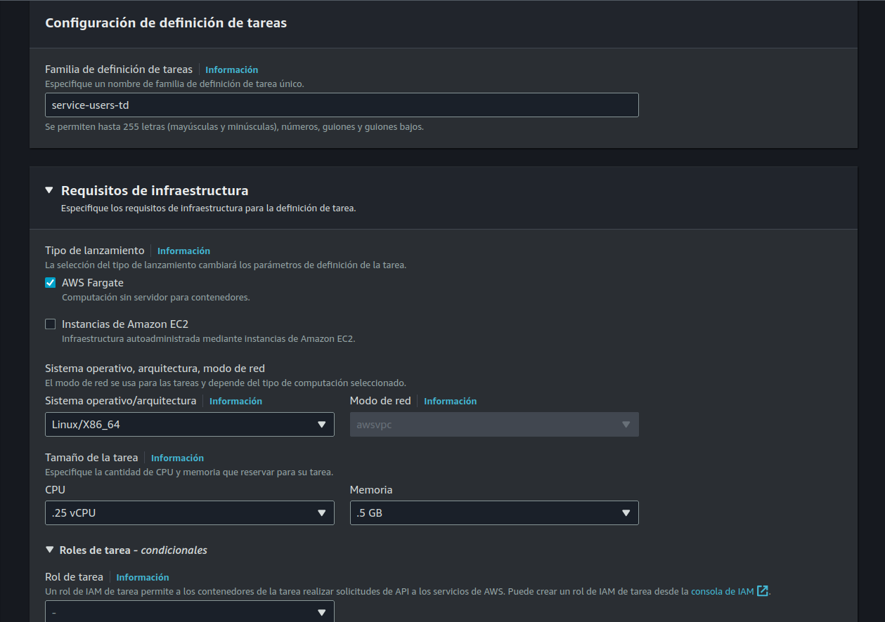
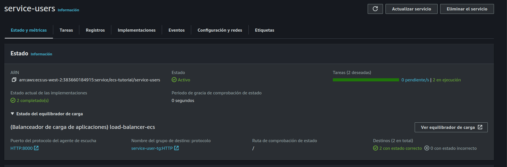

# PARTE 3 

En esta sección del tutorial vamos a enfocarnos en la creación de un cluster, con sus configuraciones correspondiente y también la creación de los servicios (users, products) en ECS.

Glosario

- Creación execution role
- Creación de task definition
- Creación cluster ECS 
- Creación de servicios ECS
- Pruebas de stress tests, autoscaling


## Creación execution role

**Ir a IAM -> Access management -> Roles -> Crear rol**

- **Tipo de entidad de confianza:** AWS service
- **Caso de uso:** Elastic Container Service -> Siguiente
- **Nombre:** ecs-task-execution-role 

Click en crear rol


Una vez terminado este paso ir a detalle del rol ir al detalle del rol y agregar una politica de permisos.

**Políticas de permisos -> Agregar permisos**

Agregar lo siguiente:

- AmazonECSTaskExecutionRolePolicy
- CloudWatchLogsFullAccess


## Creación de task definition

> Un task definition es una configuración que describe cómo se deben ejecutar los contenedores dentro de un servicio, es una plantilla que especifica varios parámetros y configuraciones ( imagen, CPU, memoria, variables de entorno, etc) que se utilizan para ejecutar un contenedor.


**Ir a ECS -> Definiciones de tareas -> Crear una nueva definición de tareas**

### Servicio users

- **Familia de definición de tareas:**  service-users-td
- **Requisitos de infraestructura:** AWS fargate
- **Sistema operativo/arquitectura:** x86_64
- **CPU:** .25 vCPU
- **Memoria:** .5 GB
- **Rol de ejecución de tareas:** Seleccionar el rol creado anteriormente "ecs-task-execution-role"

Contenedor:

- **Nombre:** container-users
- **URI de image:**  URI de la imagen en ECR con su tag correspondiente, por ejemplo 666.dkr.ecr.us-west-2.amazonaws.com/service-users:v0.0.1
- **Contenedor escencial:** si 
- **Utilizar la recopilación de registros de CloudWatch:** habilitar opcion

Dejar las demas opciones por default y hacer click Crear.




### Servicio products

Hacer los mismos pasos anteriores para el servicio products, pero cambiando lo siguiente.

- **Nombre:** container-products
- **URI de image:**  URI de la imagen en ECR con su tag correspondiente, por ejemplo 666.dkr.ecr.us-west-2.amazonaws.com/service-products:v0.0.1


## Creación cluster ECS 

> Un clúster ECS es un orquestador de contenedores gestionados por AWS, que permite ejecutar y escalar aplicaciones en contenedores usando servicios como Fargate o EC2.

**Para esto debemos ir a ECS -> Clusters -> Crear cluster**

- **Nombre del clúster:** ecs-cluster
- **Infraestructura:** Fargate

Dejar las demás opciones por default y click en Crear.


## Crear servicios ECS

**Ir a detalle del cluster creado anteriormente y click en Crear**

### Servicio users

> Un servicio ECS  permite ejecutar y gestionar contenedores Docker en un clúster, facilitando la implementación, escalado y administración. Utiliza definiciones de tareas para especificar los contenedores y sus configuraciones y permite la integración con un Load balancer.

**Entorno**
- **Opciones informáticas:**  Tipo de lanzamiento
- **Tipo de lanzamiento:** Fargate
- **Version de la plataforma:** Latest

**Configuración de implementación**

- **Tipo de aplicación:** Servicio
- **Definición de tareas:**  Seleccionar task definition "service-users-td"
- **Revision**: Mas reciente
- **Nombre del servicio:** service-users-ecs
- **Tipo de servicio:**: Replica
- **Tareas deseadas:** 1

**Conexión de servicio** - este servicio nos va a permitir conectar los servicios usando un DNS interno.

- **Configuración de conexión de servicio**: Cliente y servidor
- **Espacio de nombres**: ecs-tutorial
- **Agregar mapeos de puertos y aplicaciones**
	- **Alias de puerto:** Seccionar contenedor
	- **Detección:** users
	- **DNS:** users
	- **Puerto:** 3000

En este caso los servicios que están el mismo cluster se pueden comunicar al servicio user con esta URL http://users:3000

---

**Redes**

- **VPC:** default
- **Subredes:** Seleccionar us-west-1a, us-west-1b
- **Grupo de seguridad:** Seleccionar los siguientes security groups
	- container-lb-sg
	- container-3000 
- **IP publica:** Activado

---

**Balanceo de carga**

- **Tipo de balanceador de carga:** Balanceador de carga de aplicaciones
- **Contenedor**: default
- **Balanceador de carga:** Usar un balanceador de carga existente -> seleccionar el load balancer creado anteriormente
- **Agente de escucha:** Utilizar un agente de escucha existente, seleccionar el valor 8000:HTTP
- **Grupo de destino:** Utilizar grupo existente,  seleccionar el target group creado anteriormente "service-users-tg"

--- 
**Escalado automático de servicios**

- **Cantidad mínima de tareas:** 1
- **Cantidad máxima de tareas:** 3
- **Tipo de política de escalado:** Seguimiento de destino
	- **Nombre de la política:** cpu
	- **Métrica de servicio de ECS**: EcsServiceAverageCPUUtilization
	- **Valor de destino:** 70
- **Tipo de política de escalado:** Seguimiento de destino
	- **Nombre de la política:** memory
	- **Métrica de servicio de ECS**: EcsServiceAverageMemoryUtilization
	- **Valor de destino:** 70

Con esta configuración el servicio va a escalar tanto si la CPU o la memoria supera el 70% de uso en un periodo de 60 segundos.

Click en Crear


### Servicio products

La creación del servicio products es similar al servicio users,  pero con las siguientes modificaciones.

Configuración de implementación
- **Nombre del servicio:** service-products-ecs
- **Definición de tareas:**  Seleccionar task definition "service-products-td"

Conexión de servicio
- **Detección:** products
- **DNS:** products

Balanceo de carga
- **Grupo de destino:** Utilizar grupo existente,  seleccionar el target group creado anteriormente "service-products-tg"
- **Agente de escucha:** Utilizar un agente de escucha existente, seleccionar el valor 8001:HTTP
- **Grupo de destino:** Utilizar grupo existente,  seleccionar el target group creado anteriormente "service-products-tg"

Una vez creado estos servicios deberíamos poder acceder desde el DNS de load balancer

Users: http://[YOURLOADBALANCERDND]:8000

Products: http://[YOURLOADBALANCERDND]:8001

### Actualizar servicios.

Para poder verificar que los servicios se puedan conectar entre si usando "service connect", debemos actualizar el codigo de ambos servicios

services/users/.env

```sh
API_VERSION=v0.0.2
SERVICE_PRODUCTS=http://products:3000
```

services/users/main.go
```go
package main

import (
	"encoding/json"
	"fmt"
	"io"
	"math"
	"net/http"
	"os"

	"github.com/go-chi/chi/v5"
	"github.com/go-chi/chi/v5/middleware"
	"github.com/joho/godotenv"
)

func main() {

	err := godotenv.Load()
	if err != nil {
		panic("Error loading .env file")
	}

	r := chi.NewRouter()
	r.Use(middleware.Logger)
	r.Get("/", func(w http.ResponseWriter, r *http.Request) {
		w.Write([]byte("service users version " + os.Getenv("API_VERSION")))
	})

	r.Get("/users", func(w http.ResponseWriter, r *http.Request) {
		type User struct {
			ID    int    `json:"id"`
			Name  string `json:"name"`
			Email string `json:"email"`
		}

		users := []User{
			{ID: 1, Name: "John Doe", Email: "jhon@gmail.com"},
			{ID: 2, Name: "Jane Doe", Email: "jane@gmail.com"},
		}

		w.Header().Set("Content-Type", "application/json")
		json.NewEncoder(w).Encode(users)
	})

	r.Get("/service-products", func(w http.ResponseWriter, r *http.Request) {
		resp, err := http.Get(os.Getenv("SERVICE_PRODUCTS") + "/products")
		if err != nil {
			http.Error(w, err.Error(), http.StatusInternalServerError)
			return
		}
		defer resp.Body.Close()

		body, err := io.ReadAll(resp.Body)
		if err != nil {
			http.Error(w, err.Error(), http.StatusInternalServerError)
			return
		}

		w.Write(body)
	})

	http.ListenAndServe(":3000", r)
}
```

Ejecutamos el script deploy.sh actualizando la version de la imagen users

```sh
deploy.sh <registry_name> <image_name:version> <region>
```


services/products/.env

```sh
API_VERSION=v0.0.2
SERVICE_USERS=http://users:3000
```

services/products/main.go
```go
package main

import (
	"encoding/json"
	"io"
	"net/http"
	"os"

	"github.com/go-chi/chi/v5"
	"github.com/go-chi/chi/v5/middleware"
	"github.com/joho/godotenv"
)

func main() {

	err := godotenv.Load()
	if err != nil {
		panic("Error loading .env file")
	}

	r := chi.NewRouter()
	r.Use(middleware.Logger)
	r.Get("/", func(w http.ResponseWriter, r *http.Request) {
		w.Write([]byte("service products API version " + os.Getenv("API_VERSION")))
	})

	r.Get("/products", func(w http.ResponseWriter, r *http.Request) {
		type Product struct {
			ID    int    `json:"id"`
			Name  string `json:"name"`
			Price int    `json:"price"`
		}

		products := []Product{
			{ID: 1, Name: "Laptop", Price: 1000},
			{ID: 2, Name: "Mouse", Price: 20},
			{ID: 3, Name: "Keyboard", Price: 50},
		}

		w.Header().Set("Content-Type", "application/json")
		json.NewEncoder(w).Encode(products)

	})

	r.Get("/service-users", func(w http.ResponseWriter, r *http.Request) {
		resp, err := http.Get(os.Getenv("SERVICE_USERS") + "/users")
		if err != nil {
			http.Error(w, err.Error(), http.StatusInternalServerError)
			return
		}
		defer resp.Body.Close()

		body, err := io.ReadAll(resp.Body)
		if err != nil {
			http.Error(w, err.Error(), http.StatusInternalServerError)
			return
		}

		w.Write(body)
	})
	http.ListenAndServe(":3000", r)
}
```

Ejecutamos el script deploy.sh actualizando la version de la imagen products

```sh
deploy.sh <registry_name> <image_name:version> <region>
```

Para ver estos cambios reflejados tenemos que actualizar la definición de tareas de los servicios. 

**Ir a ECS -> Definiciones de tareas -> Seleccionar la definición de tareas -> Crear una revision de tareas**

En la la sección contenedor buscar la definición de URI y actualizar el valor con la version correspondiente.


Hacer el mismo proceso tanto para "service-users-td" y "service-products-td"


Para aplicar el nuevo cambio en las tareas,  debemos actualizar el servicio en particular.

**Ir a ECS -> Clusters -> ecs-cluster -> service-users -> Actualizar**

Seleccionar la ultima version de la definición de tareas y click en Actualizar servicio.
Realizar el mismo proceso para el servicio products.

Una vez realizados estos cambios esperamos unos minutos a que ECS termine de actualizar los servicios y probamos la conexion entre los servicios de esta manera.

```sh
curl http://[YOURLOADBALANCERDNS]:8000/service-products
# Response 
[{"id":1,"name":"Laptop","price":1000},{"id":2,"name":"Mouse","price":20},{"id":3,"name":"Keyboard","price":50}]

curl http://[YOURLOADBALANCERDNS]:8001/service-users
# Response
[{"id":1,"name":"John Doe","email":"jhon@gmail.com"}, {"id":2,"name":"Jane Doe","email":"jane@gmail.com"}]
```


## Pruebas de stress tests, autoscaling

Como vimos en el paso previo los servicios están configurados para escalar de acuerdo al uso de CPU y memoria, para poder probar esto debemos subir una nueva version de la imagen y posteriormente vamos a realizar pruebas de stress en nuestro servicios users para asegurarnos de que el escalamiento este funcionando correctamente.


En el archivo services/users/main.go agregar lo siguiente

```go

func isPrime(n int) bool {
	if n <= 1 {
		return false
	}
	for i := 2; i <= int(math.Sqrt(float64(n))); i++ {
		if n%i == 0 {
			return false
		}
	}
	return true
}

r.Get("/stress-test", func(w http.ResponseWriter, r *http.Request) {
	limit := 1000000
	for i := 2; i <= limit; i++ {
		if isPrime(i) {
			fmt.Printf("%d is a prime number\n", i)
		}
	}

	w.Write([]byte("Stress test completed"))
})

```

Este código agrega un nuevo endpoint llamado "/stress-test" en el cual vamos a utilizar una función para calcular los números primos hasta el numero 1000000, esto va a generar un alto uso de CPU.

Hacemos un nuevo deploy tal cual el paso anterior, actualizamos la definición de tareas y el servicio users.

Como habrán notado hacer este proceso de manera manual se puede volver tedioso, mas adelante vamos a ver como automatizar este proceso usando el CLI de aws.


Instalar herramienta vegeta siguiendo las instrucciones de este link.

https://github.com/tsenart/vegeta


Ejecutar el siguiente comando

```sh
echo "GET http:/[YOURLOADBALANCERDNS]:8000/stress-test" | vegeta attack -duration=120s | tee results.bin | vegeta report
```

Vegeta va a realizar un ataque de stress al endpoint "/stress-test" por 120 segundos con múltiples workers de manera concurrente, esto va a generar un alto uso de CPU en el servicio users el cual va a disparar el autoscaling.

Si todo sale como lo esperado, deberíamos ver en el dashboard de ECS que la cantidad de instancias del servicio users se incremento a 2,  esto se puede ver en la sección 
**ECS -> Clusters -> ecs-cluster -> service-users.**



Después de unos minutos de terminado el stress-test, el servicio va a realizar un scale in y va a volver a la cantidad de tareas original, que en nuestro caso esta definido en una sola instancia.

Se puede ver el estado de la alarma que genere el autoscaling en la sección **CloudWatch -> Alarmas -> Todas las alarmas**


### Resumen
En este tutorial vimos como realizar el proceso de creación de cluster ECS, con sus configuraciones correspondientes, creación de servicios, definiciones de tareas asi como la configuración de autoscaling y pruebas de stress.

