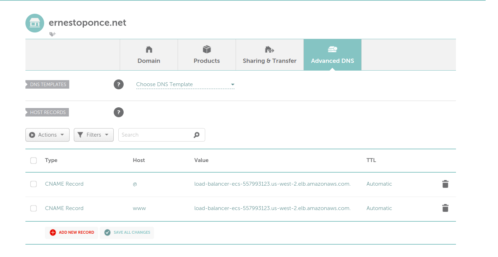
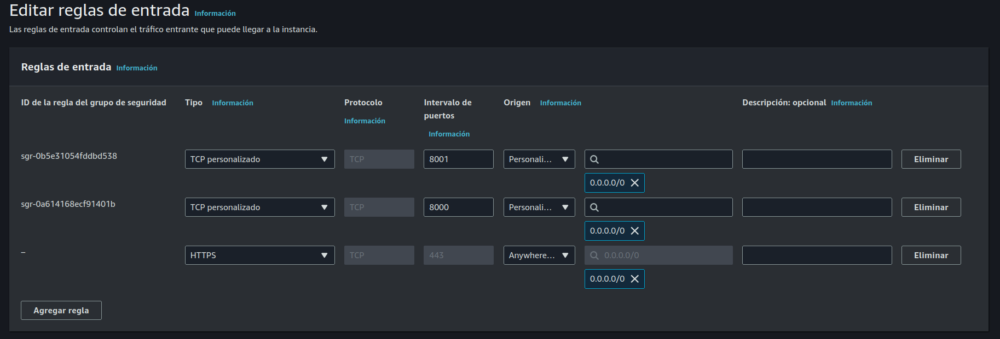

# PARTE 4

En esta parte del tutorial vamos el load balancer para que se pueda acceder desde un dominio personalizado via HTTPS.

- Configuración dominio.
- Configuración load balancer SSLq
- Agregar WAF firewall

Al momento tenemos un load balancer al cual podemos acceder mediante la dirección DNS que nos proporciona AWS.

http://[YOURLOADBALANCERDNS]:8000

En esta parte del tutorial el objetivo es asociar un nombre de dominio a nuestro load balancer y configurar un certificado SSL para poder acceder a los servicios de manera segura.

En mi caso voy a usar un dominio que tengo creado en NameCheap,  pero pueden usar cualquier otro proveedor de dominios en el cual tengan acceso a modificar los registros DNS.

### Creación certificado SSL    

> AWS Certificate Manager (ACM) es un servicio que permite aprovisionar, gestionar y desplegar fácilmente certificados SSL/TLS públicos y privados para su uso con servicios de AWS.

Para poder crear un certificado SSL en AWS necesitamos ir a la sección de ACM (Amazon Certificate Manager) y click en Solicitar.

En nombres de dominio vamos a agregar dos valores

- yourdomain.com
- *.yourdomain.com

El * nos permite poder validar cualquier subdominio que se cree en el dominio principal.
Por ejemplo: api.yourdomain.com, users.yourdomain.com, etc.

Dejar las demás opciones por default (Validación de DNS) y click en solicitar.

Ir a detalle de certificado y copiar los siguientes valores de los 2 dominios requeridos anteriormente.

**Nombre CNAME y valor CNAME**

Ir a la configuración de nuestro dominio DNS y agregar un nuevo registro CNAME con el nombre y valor copiado anteriormente.

- Host: _AAAA1111
- Value: _AAAA1111.acm-validations.aws.

En el caso de usar NameCheap tener en cuenta que el valor del host copiado desde ACM no debe tener el dominio.

Por ejemplo.

_AAAA1111.mydomain.com.

Debe quedar de la siguiente manera

_AAAA1111

> Nota: Tener en cuenta que en otros proveedores de DNS esto puede ser diferente y requiera copiar el valor completo.

Este proceso de validación via DNS puede tardar unos 5 minutos aproximadamente, el status de esta petición lo podemos ver en la sección de ACM en AWS , una vez finalizado el proceso el estado del certificado debe estar marcado como "Emitido".

### Configurar dominio

**Ir a detalle de dominio - Advanced DNS **

Debemos agregar dos registro de CNAME con estos valores

**Host:** @ 

**Value:** [YOURLOADBALANCERDNS]

--- 

**Host:** www

**Value:** [YOURLOADBALANCERDNS]

Una vez realizado estos pasos podemos acceder a nuestro servicio usando nuestro dominio, tener en cuenta que el proceso de propagación de DNS puede tardar unos minutos.

http://[YOURDOMAIN]:8000 -> users
http://[YOURDOMAIN]:8001 -> products

### Configuración load balancer SSL

Previo a la configuración del load balancer,  debemos modificar el security group asociado al load balancer para permitir el trafico HTTPS.

**Ir a EC2 -> Red y seguridad -> Security groups -> click en load-balancer-sg -> Editar reglas de entrada**

Agregar regla 

- **Tipo:** HTTPS
- **Protocolo:** TCP
- **Intervalo de puertos:** 443
- **Origen:**  Anywhere - 0.0.0.0/0

Click en Guardar reglas

Una vez terminado esto, debemos modificar la configuración del load balancer para que pueda aceptar trafico HTTPS.

**Ir a la sección de EC2 -> Load Balancers -> load-balancer-ecs -> Agente de escucha y reglas -> Agregar agente de escucha**

Configuración agente de escucha:
- Protocolo: HTTPS
- Puerto: 443

Acciones Predeterminadas

- Reenviar a grupos de destino
- Grupo de destino: service-users-tg

**Configuración de agente de escucha seguro**

Certificado de servidor SSL/TLS predeterminado

- Origen del certificado: de ACM
- Certificado de ACM: Seleccionar certificado creado anteriormente en ACM

Dejar los demás valores por default y click en Agregar

Después de terminada esta configuraron podemos ingresar a nuestro dominio de esta manera

https://[YOURDOMAIN]

### Configuración subdominios servicios

Para poder acceder a los servicios creados en ECS vamos a configurar un subdominio para cada servicio.

Por ejemplo:

**users:** https://users.[YOURDOMAIN]

**products:** https://products.[YOURDOMAIN]

Como primer paso debemos ir a la configuración de DNS de nuestro dominio y agregar dos registros CNAME con los siguientes valores.

- Host: users
- Value: [YOURLOADBALANCERDNS]

---

- Host: products
- Value: [YOURLOADBALANCERDNS]

Posteriormente debemos modificar la configuración del load balancer en AWS

**Ir a la sección de EC2 -> Load Balancers -> load-balancer-ecs -> Agente de escucha y reglas**

Seleccionar el agente de escucha HTTPS -> Administrar reglas -> Agregar una regla

Nombre y etiquetas  

- Nombre: users-rules

Agregar condicion

Encabezado de Host

- users.[YOURDOMAIN]	

Tipos de accion 

Reenviar a grupos de destino

- Prioridad 1
- Grupos de destino: service-users-tg

Crear los mismo pasos pero para el servicio products, modificando el valor del host en la condicion a products.[YOURDOMAIN] y el grupo de destino a service-products-tg.

### WAF firewall

Si bien tenemos nuestro servicio y load balancer funcionando, es importante tener en cuenta la seguridad de los servicios que estamos exponiendo a los usuarios, para esto vamos a configurar un WAF (Web Application Firewall) el cual nos va a permitir proteger nuestros servicios de ataques comunes como pueden ser SQL injection, XSS, etc.

**Ir Integraciones -> AWS Web Application Firewall**

Click en Asociar WAF

Dejar las opciones por default, el cual utiliza 3 reglas de protección predefinidas,  el comportamiento por default va a ser bloquear el trafico que no cumpla con estas reglas,  click en Asociar.

Podemos ver el detalle del servicio en la sección de AWS WAF & SHIELD.

### Resumen

En esta parte del tutorial hemos configurado un dominio y certificado SSL para acceder a los servicios de manera segura, ademas hemos configurado un WAF para proteger nuestros servicios de ataques comunes como SQL injection, XSS, etc.

