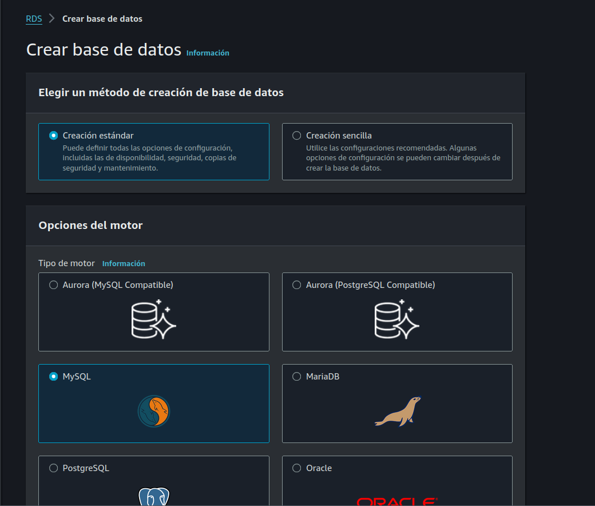

AWS - MICROSERVICES

TODO 

- Explicar proyecto, diagrama, servicio a utilizar
- Creación de imagenes docker,  servicio go users, products
- Crear usuario IAM con permisos
- Creacion de ECR
- Instalar CLI aws , configuraion access key
- Deployar version v0.0.1 a ECR 
- Crear security groups para servicios puerto 8000 y 8001
- Crear target group para los 2 servicios
- Crear load balanacer, configuracion listeners, etc.
- Crear task definition ECS container go y nodejs 
- Crear cluster ECS 
- Crear security groups para ECS 
- Crear servicios ECS , asociarlo a load balancer
- Servicio task job cron
- Crear RDS servicio mysql, connect and add mysql tablas para testing
- Actualizar docker images , connect to mysql, deploy ECR
- Actualizar servicios
- Pruebas de stress tests,  probar autoscaling
- configuracion dominio, https, load balancer setup
- WAF firewall
- Eliminacion de servicios.
- CLI AWS deploy servicios
- CD - CI pipeline

# PARTE 5
En esta seccion vamos a configurar nuestros servicios para que se puedan conectar a una base de datos mysql,  para esto vamos a utilizar un servicio de AWS llamado RDS 

Este es un servicio que proporciona una base de datos relacional completamente administrada en la nube. Permite a los desarrolladores configurar, operar y escalar fácilmente una base de datos relacional en la nube sin tener que preocuparse por la infraestructura. RDS admite varios motores de bases de datos, como MySQL, PostgreSQL, Oracle, SQL Server y Amazon Aurora, backups automatizados,  configuracion en multiples zonas de disponibilidad, etc.

Para este tutorial vamos a utilizar Mysql.

Previo a la creacion de la base de datos debemos agregar un security group que permita la conexion la base de datos desde otros servicios.

### Grupo de seguridad
Ir a EC2 -> Red y seguridad -> Security groups -> Crear security group

Nombre: rds-sg
Descripcion: security group para la conexion a la base de datos
VPC: default

Reglas de entrada -> Agregar regla

- Tipo: MySQL/Aurora
- Origen: Anywhere IPV4

Click en Crear security group

### RDS
Ir al dashboard de AWS -> RDS -> Bases de datos -> Crear base de datos

Elegir un método de creación de base de datos: Creacion estandar

Opciones del motor
- Tipo de motor: mysql
- Version del motor: mysql 8.0.55

Plantillas: Desarrollo y pruebas

Configuracion:
- Identificador de la base de datos: ecs-tutorial
- Nombre de usuario: admin
- Administracion de credenciales: Autoadministrado
- Contraseña: [YOURPASSWORD]
- Confirmar contraseña: [YOURPASSWORD]

Configuracion de la instancia

- Unchecked: Mostrar las clases de instancia que admiten las escrituras optimizadas de Amazon RDS
- Check en incluir clases de generacion anterior ( esto nos va a permitir seleccionar una clase de instancia con menos recursos)
- Clase de instancia: db.t4.micro

Alamacenamiento: Dejar valores default

Conectividad:
- Recurso de computacion: No se conecta a un grupo de EC2
- Tipo de red: IPv4
- Acceso publico: Si
- Grupo de seguridad firewall: Elegir existente, seleccionar el security group creado anteriormente "rds-sg"

Autenticación de bases de datos: Auteenticacion de contraseña

Dejar las demas configuraciones por default ,  click en crear base de datos.

TODO IMAGEN

Conclusiones:

En este tutorial hemos creado un proyecto en el cual hemos utilizado varios servicios de AWS para un proyecto de microservicios, hemos creado dos servicios users y products, los cuales se comunican entre si y se exponen al publico a traves de un load balancer,  hemos configurado un dominio y certificado SSL para acceder a los servicios de manera segura,  ademas hemos configurado un WAF para proteger nuestros servicios de ataques comunes.

Finalmente y muy importante en caso de que no vayan a utilizar los servicios creados en este tutorial,  es elminar todos los recursos creados en AWS para evitar costos no deseados.

Espero que este tutorial les haya sido de utilidad,  cualquier duda o consulta pueden contactarme a traves de mi correo personal.

#### 

