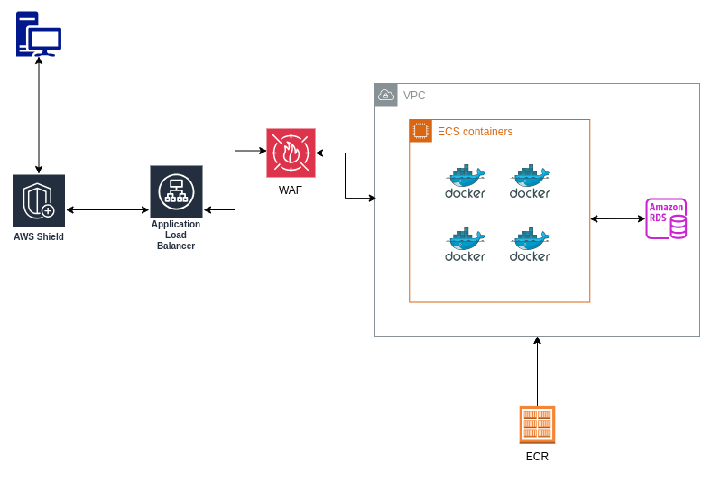
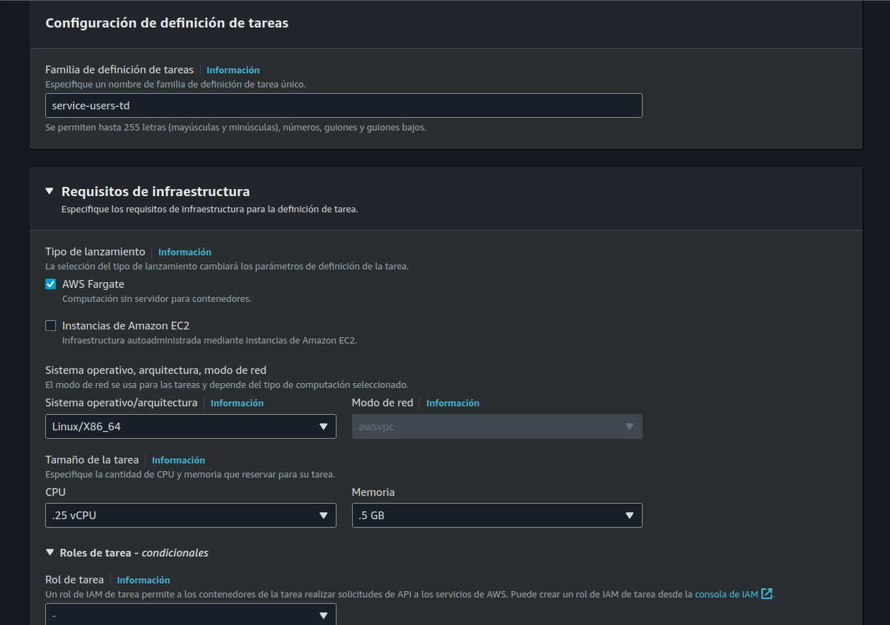
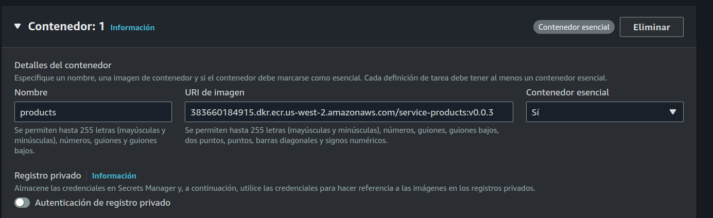
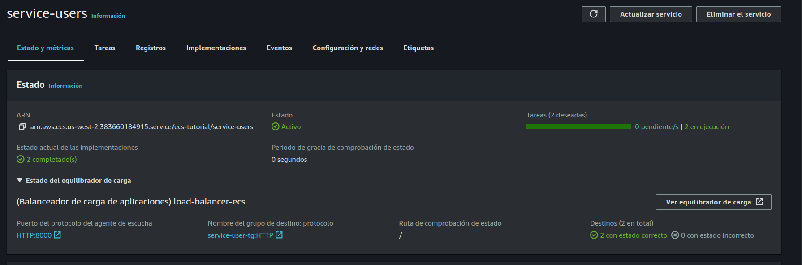
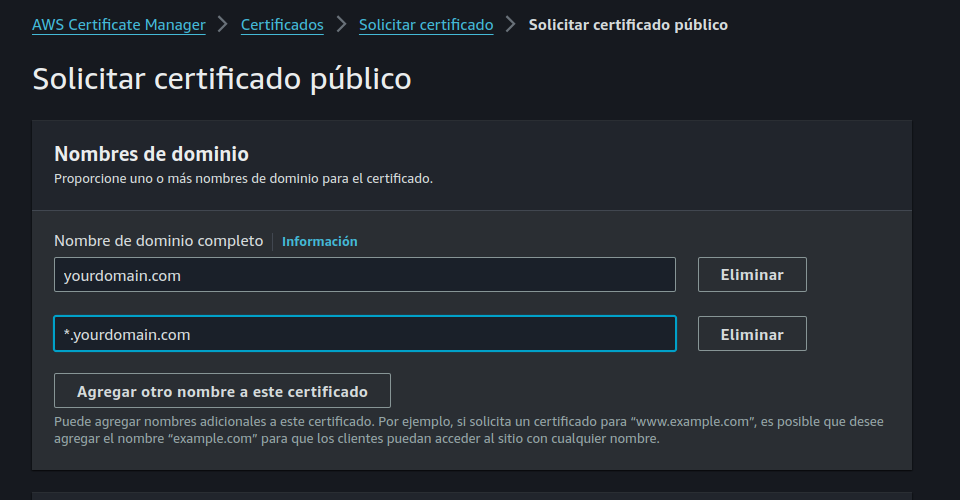
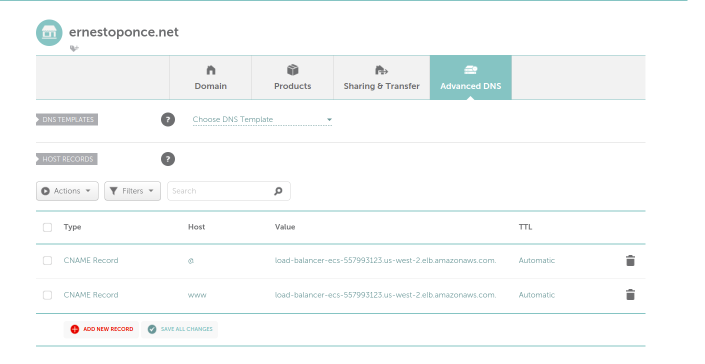
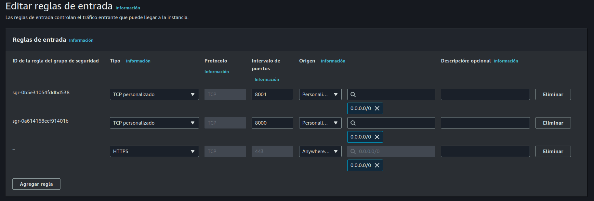
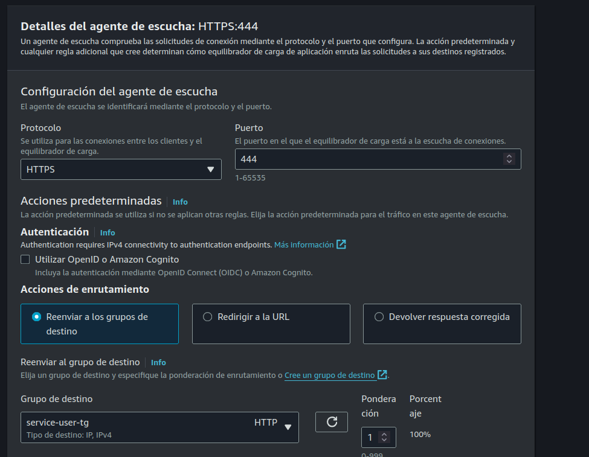
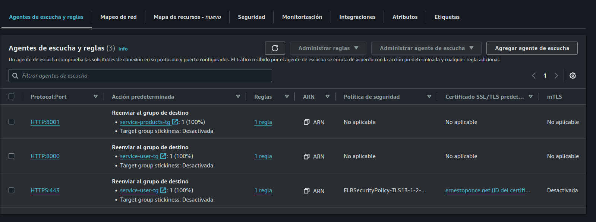
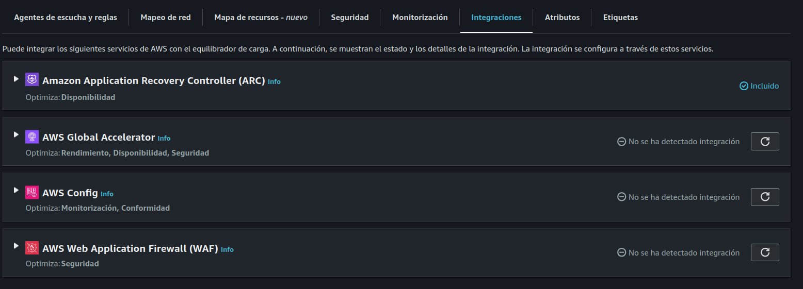

AWS - MICROSERVICES

TODO 

- Explicar proyecto, diagrama, servicio a utilizar
- Creacion de imagenes docker,  servicio go users, products
- Crear usuario IAM con permisos
- Creacion de ECR
- Instalar CLI aws , configuraion access key
- Deployar version v0.0.1 a ECR 
- Crear security groups para servicios puerto 8000 y 8001
- Crear target group para los 2 servicios
- Crear load balanacer, configuracion listeners, etc.
- Crear task definition ECS container go y nodejs 
- Crear cluster ECS 
- Crear security groups para ECS 
- Crear servicios ECS , asociarlo a load balancer
- Servicio task job cron
- Crear RDS servicio mysql, connect and add mysql tablas para testing
- Actualizar docker images , connect to mysql, deploy ECR
- Actualizar servicios
- Pruebas de stress tests,  probar autoscaling
- configuracion dominio, https, load balancer setup
- WAF firewall
- Eliminacion de servicios.
- CLI AWS deploy servicios
- CD - CI pipeline


# Parte 1 

- Explicaion de proyecto
- Creacion ERC repositorio
- Creacion de imagenes, deploy


En este tutorial vamos a crear un proyecto en el cual vamos a utilizar microservicios,  los cuales van a estar ejecutandose en AWS.
Vamos a estar utilizando los siguentes servicios de AWS.

ECS 
Load Balancer
RDS
ERC

Los servicios se van a conectar a una base de datos mysql y ademas se van a conectar entre si intercambiando mensajes.

TODO DIAGRAMA



Docker image -  service users
Docker image -  service productus

Vamos a crear dos servicios para el proyecto,  en general el numero de este va a ser mayor, 
pero en pos de mantener simple el tutorial vamos a limitarnos al momento a solo dos servicios.

![IMAGE] (images/diagram.png)


## Crear micro-servicio users container


Para crear el servicio users,  se debe crear una carpeta llamado users y agregar una definicion de Dockerfile

$ mkdir -p docker/users

En la carpeta docker/users agregar los siguientes archivos

go.mod

```
module service-users

go 1.22.3

require (
	github.com/go-chi/chi/v5 v5.1.0 // indirect
	github.com/joho/godotenv v1.5.1 // indirect
)
```

En este archivo definimos la version de go que vamos a utilizar para compilar el servicio y las dependecias a utilizar
en este caso serian las siguiente:
go-chi: es un router http el cual nos facilita la creacion de endpoints, middlewares, etc.
godotenv: es una libreria que nos permite definir variables de entorno en un archivo .env.

main.go

```go
package main

import (
	"log"
	"net/http"

	"github.com/go-chi/chi/v5"
	"github.com/go-chi/chi/v5/middleware"
	"github.com/joho/godotenv"
)

func main() {

	err := godotenv.Load()
	if err != nil {
		log.Fatal("Error loading .env file")
	}

	r := chi.NewRouter()
	r.Use(middleware.Logger)
	r.Get("/", func(w http.ResponseWriter, r *http.Request) {
		w.Write([]byte("service users API version " + os.Getenv("API_VERSION")))
	})
	http.ListenAndServe(":3000", r)
}
```
En la funcion main hacemos una llamada a godotenv.Load() para cargar las variables de entorno definidas en el archivo .env
en caso de encontrar un error al cargar el archivo se termina la ejecucion del programa.

Despues iniciamos un router de go-chi y definimos un endpoint en la raiz del servidor el cual va a mostrar la version de la API correspondiente al valor definido en el archivo .env.


.env

```
API_VERSION=1.0.0
```

En este archivo al momento solo definimos la version de la API,  mas adelante vamos a agregar mas valores como serian los 
valores de conexion a una base de datos.

Dockerfile

```
# syntax=docker/dockerfile:1

# Build the application from source
FROM golang:1.22 AS build-stage

WORKDIR /app

COPY go.mod go.sum ./
RUN go mod download

COPY . ./

RUN CGO_ENABLED=0 GOOS=linux go build -o /service

FROM gcr.io/distroless/base-debian11 AS build-release-stage

WORKDIR /

COPY --from=build-stage /service /service
COPY .env ./

EXPOSE 3000


ENTRYPOINT ["/service"]
```

En este archivo Dockerfile vamos utilizar un concepto llamado multi-stage build,  el cual nos permite utilizar una imagen base para compilar el servicio ( golang 1.22) copiar los archivos necesarios, descargar dependencias y finalmete compilar el servicio en un binario llamado service.
La segunda imagen (gcr.io/distroless/base-debian11) es la que se va a utilizar en ECS para ejecutar la API,  esta imagen es una imagen minimalista que solo contiene lo necesario para ejecutar el binario, el cual tenemos que copiar desde el output obtenido del build previo, ademas necesitamos copiar el .env, exponenmos el puerto 3000 e iniciamos el binario ./service.


Para probar esto debemos ejecutar los siguentes comandos en una terminal
```sh
docker build  -f Dockerfile-go -t service-users:v0.0.1 .
docker run -p 3000:3000 service-users:v0.0.1
```


## Crear usuario IAM credenciales

Para poder subir nuestra imagen a ECR necesitamos un usuario en AWS con los permisos correspondientes, para esto debemos realizar los siguiente.

Ir al dashboard de nuestra cuenta de AWS e ir a la siguiente seccion.

IAM -> Administracion de usuarios -> Usuarios -> Agregar usuario

Como nombre poner lo siguiente "ecs-lb-tutorial" click en siguiente.
En seccion Establecer permisos -> Opciones de permisos seleccionar Adjuntar politicas directamente -> Crear politica
En politicas de permisos buscar por "AmazonEC2ContainerRegistryFullAccess" seleccinar la politica y click en siguiente y 
finalizar la creacion del usuario.

### Crear access key

Necesitamos un access and private key para poder comunicarnos a los servicios de AWS usando la cli, para esto debemos ir al detalle del usuario creado anteriormente,  Administracion de usuarios -> Usuarios.

Ir a tab Credenciales de seguridad -> Crear clave de acceso 
En casos de usos seleccionar Otros, click en Siguiente -> Crear clave de acceso
Copiar en un lugar seguro la clave de acceso y el secret key, ya que no se va a poder ver nuevamente.


# Crear ECR repositorio

La region que vamos a utilizar es Viriginia,  es importante que todos los servicios que requieran una seleccion de region esten creados en el mismo lugar.

Para poder subir nuestras imagenes a AWS necesitamos un repositorio en ECR, para esto debemos ir a la consola de AWS y buscar por ECR.
Ir a seccion -> Private registry -> Repositorios -> Crear repositorio

Como nombre poner "service-users",  modificar mutablidad a "Inmutable", esto lo que va a generar es que no se puedan subir imagenes con el mismo tag, para evitar problemas de diferentes versiones del servicio con el mismo tag,  obliga a que cada nuevo deploy este asociado a un tag diferente.

Dejamos las demas opciones en default y click en Crear repositorio.

TODO PONER IMAGEN

#### Instalacion CLI aws
Necesitamos tener instalado en nuestra maquina la herramienta CLI de aws,  sigue las instrucciones de acuerdo a tu sistema operativo en el siguient link.

https://docs.aws.amazon.com/cli/latest/userguide/getting-started-install.html 

Una vez instalado la CLI de aws,  debemos configurar las credenciales de acceso que creamos anteriormente para esto ejecutamos el siguiente comando en una terminal.

```sh
aws configure
```
En la terminal debemos utilizar las credenciales (access key, private key) creadas en el paso anterior y como region default seleccionar "us-east-1" (Virginia).

#### Uplaod imagen a ECR

El la carpeta docker/users agregar un archivo llamado deploy.sh con el sigueinte contenido.

deploy.sh
```sh
#!/bin/bash

if [ $# -ne 3 ]; then
    echo "Usage: deploy.sh <registry_name> <image_name> <region>"
    exit 1
fi

REGISTRY_URI=$1
REGISTRY_NAME=$2
REGION=$3

aws ecr get-login-password --region $REGION | docker login --username AWS --password-stdin $REGISTRY_URI

docker build -t $IMAGE_NAME .

docker tag $IMAGE_NAME $REGISTRY_URI/$REGISTRY_NAME

docker push $REGISTRY_URI/$REGISTRY_NAME
```

Este script recibe tres argumentos.
URI de repositorio
Nombre del repositorio
Region de aws

Antes de ejecutar el script debemos darle permisos de ejecucion.

```sh
chmod +x deploy.sh
```

Para subir la imagen a ECR ejecutamos el siguiente comando, modificando los valores correspondientes generandos en su cuenta de AWS, el valor URI del repositorio se encuentra en el dashboard de ECR.

```sh
./deploy.sh 666.dkr.ecr.us-west-2.amazonaws.com service-user:v0.0.1 us-west-1
```

Si todo salio correctamente deberiamos ver la version de la imagen en el dashboard de ECR.


## Servicio products

Debido a que el contenido del servicio productos es practicamente igual al de users ( solo va a cambiar el contenido del archivo main.go) vamos a ejecutar un comando para hacer una copia de users y modificar los archivos necesarios.

```sh
cp -ra services/users services/products
```

Modificar la respuesta del endpoint en el archivo services/procuts/main.go

```go
///////////////////////////////////////////////////////////////
r.Get("/", func(w http.ResponseWriter, r *http.Request) {
	w.Write([]byte("service products API version " + os.Getenv("API_VERSION")))
})
///////////////////////////////////////////////////////////////
```

Crear un nuevo repositorio privado en ECR con el nombre service-products y realizar un deploy con el script deploy.sh

```sh
./deploy.sh <registry-uri> <registry-name> <region>  
```


# PARTE 2 

## Creacion de load balancer

En este proyecto vamos a utilizar un load balancer para distribuir el trafico entre los servicios users y products que postierormente vamos a crear en ECS, pero antes de eso debemos configurar otros servicios requeridos.


#### Crear security groups

El primer security group que vamos a crear va a estar asociado al load balancer y es el que va a permitir el trafico de entrada tanto al puerto 8000 como al 8001.

Para esto tenemos que ir a  EC2 -> Red y seguridad -> Security groups -> Crear security group

Como nombre ponemos el valor "load-balancer-sg" y una descripcion "security group para accesso externo al load balancer" , dejamos el valor de VPC por default

Como regla de entrada agregamos estas dos configuraciones.

- Tipo: TCP personalizado 
- Protocolo: TCP
- Intervalo de puertos: 8000
- Origen:  Anywhere - Esto va a permitir el trafico de cualquier IP al puerto 8000

--- 
---
---

- Tipo: TCP personalizado 
- Protocolo: TCP
- Intervalo de puertos: 8001
- Origen:  Anywhere - Esto va a permitir el trafico de cualquier IP al puerto 8000


En reglas de salida dejamos el valor default, el cual permite el trafico de salida a cualquier origen y hacemos click en Crear security group.

El segundo security group que vamos a crear va a estar asociado a los servicios de ECS, este debe estar asociado al segundo security group creado anteriormente,  para que todo el trafico de entrada provenga desde el load balancer.

Como nombre ponemos el valor "container-sg" y una descripcion "security group para la comunicacion entre el load balancer y los contenedores" , dejamos el valor de VPC por default

- Tipo: Todos los TCP
- Protocolo: TCP
- Intervalo de puertos: 0-65535
- Origen:  Personalizada
- Origen valor: Buscar el nombre del security group creado anteriormente "load-balancer-sg" y seleccionarlo.

Dejar las reglas de salida por default y click en Crear security group.

TODO AGREGAR SECURITY GROUP CONTAINER 3000


#### Crear target group

Ir a seccion EC2 -> Equilibrio de carga -> Grupos de destino -> Crear grupo de destino

Elegir un tipo de destino: Direcciones IP
Nombre del grupo de destino: service-users-tg
Protocolo: HTTP - 8000
Tipo de direccion IP: IPv4
VPC: default
Version del protocolo: HTTP1

Dejar los demas valores por defaul,  click en siguiente.

En seccion especificar direcciones IP y definir puertos,  click en eliminar IP definida por default,  estos valores
se van a crear dinamicamente cuando creemos el servicio en ECS.


Hacer el mismo paso anterior para el servicio products,  pero cambiando el nombre del grupo de destino a "service-products-tg" y el puerto a 8001.


#### Crear load balancer

Ir a seccion EC2 -> Equilibrio de carga -> Balanceadores de carga -> Crear balanceador de carga

Seleccionamos el tipo  "Balanceador de carga de aplicaciones" el cual nos va a permitir balancear el trafico hacia los servicios en ECS y configurar reglas de enrutamiento mas avanzadas.

Click en crear y definir estos valores.

- **Nombre del balanceador de carga:**  load-balancer-ecs
- Esquema: Expuesto a Internet 
- Tipo de dirección IP del equilibrador de carga: IPv4
- VPC: default
- Mapeos: us-west-1a, us-west-1b
- Grupos de seguridad: seleccionar el security group creado anteriormente "load-balancer-sg"
- Agentes de escucha y redireccionamiento: 
	- Protocolor: HTTP
	- Puerto: 8080
	- Accion predeterminada: service-user-sg
- Nuevo agentes de escucha
	- Protocolor: HTTP
	- Puerto: 8081
	- Accion predeterminada: service-products-sg


La creacion del load balancer tarda unos minutos , una vez terminado el proceso, podemos acceder al DNS del load balancer generado por AWS.

Si ingresamos a esta URL en el puerto 8000,  deberiamos ver un mensaje de 503 Service Temporarily Unavailable, nuestro proximo paso es configurar el cluster ECS para hacer uso de este servicio.


# PARTE 3 
## Crear ECS

#### Crear execution role
Ir a IAM -> Access management -> Roles -> Crear rol

- Tipo de entidad de confianza: AWS service
- Caso de uso: Elastic Container Service -> Siguiente
- Nombre: ecs-task-execution-role 

Click en crear rol

Una vez terminado este paso ir a detalle del rol ir al detalle del rol y agregar una politica de permisos.

Políticas de permisos -> Agregar permisos

Agregar lo siguiente:

- AmazonECSTaskExecutionRolePolicy
- CloudWatchLogsFullAccess


### Crear task definition

Antes de crear el cluster ECS debemos crear un task-defintion,  esto lo podemos ver como un template en el cual definimos el contenedor, tipo de recursos, logs y configuraciones que van a estar asociadas a un servicio en ECS.

Para esto tenemos que ir a ECS -> Definiciones de tareas -> Crear una nueva definicion de tareas

#### Servicio users

- **Familia de definición de tareas:**  service-users-td
- **Requisitos de infraestructura:** AWS fargate
- **Sistema operativo/arquitectura:** x86_64
- **CPU:** .25 vCPU
- **Memoria:** .5 GB
- **Rol de ejecución de tareas:** Seleccionar el rol creado anteriormente "ecs-task-execution-role"

Contenedor:

- **Nombre:** container-users
- **URI de image:**  URI de la imagen en ECR con su tag correspondiente, por ejemplo 666.dkr.ecr.us-west-2.amazonaws.com/service-users:v0.0.1
- **Contenedor escencial:** si 
- **Utilizar la recopilación de registros de CloudWatch:** habilitar opcion

Dejar las demas opciones por default y hacer click Crear.




#### Servicio products

Hacer los mismos pasos anteriores para el servicio products, pero cambiando lo siguiente.

- **Nombre:** container-products
- **URI de image:**  URI de la imagen en ECR con su tag correspondiente, por ejemplo 666.dkr.ecr.us-west-2.amazonaws.com/service-products:v0.0.1


### Crear cluster ECS 

El cluster se encarga de agrupar los servicios y tareas que vamos a ejecutar en ECS,  
Para esto debemos ir a ECS -> Clusters -> Crear cluster

- **Nombre del clúster:** ecs-cluster
- **Infraestructura:** Fargate

Dejar las demas opciones por default y click en Crear.


### Crear servicios ECS

Ir a detalle del cluster creado anteriormente y click en Crear

#### Servicio users

Entorno
- **Opciones informáticas:**  Tipo de lanzamiento
- **Tipo de lanzamiento:** Fargate
- **Version de la plataforma:** Latest

Configuración de implementación

- **Tipo de aplicación:** Servicio
- **Definición de tareas:**  Seleccionar task definition "service-users-td"
- **Revision**: Mas reciente
- **Nombre del servicio:** service-users-ecs
- **Tipo de servicio:**: Replica
- **Tareas deseadas:** 1

Conexión de servicio - este servicio nos va a permitir conectar los servicios usando un DNS interno para tener baja latencia de conexion.

- **Configuración de conexión de servicio**: Cliente y servidor
- **Espacion de nombres**: ecs-tutorial
- **Agregar mapeos de puertos y aplicaciones**
	- **Alias de puerto:** Selccionar contenedor
	- **Deteccion:** users
	- **DNS:** users
	- **Puerto:** 3000

Este definicion nos va a permitir que los servicios que esten el cluster se puedan comunicar a este servicio mediante esta URL http://users:3000


Redes

- **VPC:** default
- **Subredes:** Seleccionar us-west-1a, us-west-1b
- **Grupo de seguridad:** Seleccionar los siguientes security groups
	- container-lb-sg
	- container-3000 
- **IP publica:** Activado


Balanceo de carga

- **Tipo de balanceador de carga:** Balanceador de carga de aplicaciones
- **Contenedor**: default
- **Balanceador de carga:** Usar un balanceador de carga existente, seleccionar el load balancer creado anteriormente
- **Agente de escucha:** Utilizar un agente de escucha existente, seleccionar el valor 8000:HTTP
- **Grupo de destino:** Utilizar grupo existente,  seleccionar el target group creado anteriormente "service-users-tg"


Escalado automático de servicios

- **Cantidad minima de tareas:** 1
- **Cantidad maxima de tareas:** 3
- **Tipo de politica de escalado:** Seguimiento de destino
	- **Nombre de la politica:** cpu
	- **Métrica de servicio de ECS**: EcsServiceAverageCPUUtilization
	- **Valor de destino:** 70

Con esta configuracion el servicio va a ejecutar la accion de escalamiento cuando el uso de CPU sea mayor al 70% ( scale out) y va a reducir la cantidad de tareas cuando el uso de CPU sea menor al 70% (scale in).

Click en Crear

### Servicio products

La creacion del servicio products es similar al servicio users,  pero con las siguientes modificaciones.

Configuración de implementación
- **Nombre del servicio:** service-products-ecs
- **Definición de tareas:**  Seleccionar task definition "service-products-td"

Conexión de servicio
- **Deteccion:** products
- **DNS:** products

Balanceo de carga
- **Grupo de destino:** Utilizar grupo existente,  seleccionar el target group creado anteriormente "service-products-tg"
- **Agente de escucha:** Utilizar un agente de escucha existente, seleccionar el valor 8001:HTTP
- **Grupo de destino:** Utilizar grupo existente,  seleccionar el target group creado anteriormente "service-products-tg"

Una vez creado estos servicios deberiamos poder acceder desde el DNS de load balancer

Users: http://[YOURLOADBALANCERDND]:8000

Products: http://[YOURLOADBALANCERDND]:8001

### Actualizar servicios.

Para poder verificar que los servicios se puedan conectar entre si usando "service connect", debemos actualizar el codigo de ambos servicios

services/users/main.go
```go
package main

import (
	"encoding/json"
	"fmt"
	"io"
	"math"
	"net/http"
	"os"

	"github.com/go-chi/chi/v5"
	"github.com/go-chi/chi/v5/middleware"
	"github.com/joho/godotenv"
)

func main() {

	err := godotenv.Load()
	if err != nil {
		panic("Error loading .env file")
	}

	r := chi.NewRouter()
	r.Use(middleware.Logger)
	r.Get("/", func(w http.ResponseWriter, r *http.Request) {
		w.Write([]byte("service users version " + os.Getenv("API_VERSION")))
	})

	r.Get("/users", func(w http.ResponseWriter, r *http.Request) {
		type User struct {
			ID    int    `json:"id"`
			Name  string `json:"name"`
			Email string `json:"email"`
		}

		users := []User{
			{ID: 1, Name: "John Doe", Email: "jhon@gmail.com"},
			{ID: 2, Name: "Jane Doe", Email: "jane@gmail.com"},
		}

		w.Header().Set("Content-Type", "application/json")
		json.NewEncoder(w).Encode(users)
	})

	r.Get("/service-products", func(w http.ResponseWriter, r *http.Request) {
		resp, err := http.Get(os.Getenv("SERVICE_PRODUCTS") + "/products")
		if err != nil {
			http.Error(w, err.Error(), http.StatusInternalServerError)
			return
		}
		defer resp.Body.Close()

		body, err := io.ReadAll(resp.Body)
		if err != nil {
			http.Error(w, err.Error(), http.StatusInternalServerError)
			return
		}

		w.Write(body)
	})

	http.ListenAndServe(":3000", r)
}
```

Ejecutamos el script deploy.sh actualizando la version de la imagen

```sh
deploy.sh <registry_name> <image_name:version> <region>
```

services/products/main.go
```go
package main

import (
	"encoding/json"
	"io"
	"net/http"
	"os"

	"github.com/go-chi/chi/v5"
	"github.com/go-chi/chi/v5/middleware"
	"github.com/joho/godotenv"
)

func main() {

	err := godotenv.Load()
	if err != nil {
		panic("Error loading .env file")
	}

	r := chi.NewRouter()
	r.Use(middleware.Logger)
	r.Get("/", func(w http.ResponseWriter, r *http.Request) {
		w.Write([]byte("service products API version " + os.Getenv("API_VERSION")))
	})

	r.Get("/products", func(w http.ResponseWriter, r *http.Request) {
		type Product struct {
			ID    int    `json:"id"`
			Name  string `json:"name"`
			Price int    `json:"price"`
		}

		products := []Product{
			{ID: 1, Name: "Laptop", Price: 1000},
			{ID: 2, Name: "Mouse", Price: 20},
			{ID: 3, Name: "Keyboard", Price: 50},
		}

		w.Header().Set("Content-Type", "application/json")
		json.NewEncoder(w).Encode(products)

	})

	r.Get("/service-users", func(w http.ResponseWriter, r *http.Request) {
		resp, err := http.Get(os.Getenv("SERVICE_USERS") + "/users")
		if err != nil {
			http.Error(w, err.Error(), http.StatusInternalServerError)
			return
		}
		defer resp.Body.Close()

		body, err := io.ReadAll(resp.Body)
		if err != nil {
			http.Error(w, err.Error(), http.StatusInternalServerError)
			return
		}

		w.Write(body)
	})
	http.ListenAndServe(":3000", r)
}
```

Para ver estos cambios reflejados tenemos que actulizar la definicion de tareas de los servicio, 
para esto ir a la seccion:

ECS -> Definiciones de tareas -> Seleccionar la definicion de tareas -> Crear una revision de tareass

En la la seccion contenedor buscar la definicion de URI y actulizar con la version correspondiente.




Hacer el mismo proceso tanto para "service-users-td" y "service-products-td"


Para aplicar el nuevo cambio en las tareas,  debemos actualizar el servicio en particular.

Ir a ECS -> Clusters -> ecs-cluster -> service-users -> Actualizar 

Seleccionar la ultima version de la definicion de tareas y click en Actualizar servicio.
Realizar el mismo proceso para el servicio products.

![Image] (images/service-update.png)


Verificar que la conexion entre servicios este funcionando correctamente


```sh
curl http://[YOURLOADBALANCERDNS]:8000/service-products
# Response 
[{"id":1,"name":"Laptop","price":1000},{"id":2,"name":"Mouse","price":20},{"id":3,"name":"Keyboard","price":50}]

curl http://[YOURLOADBALANCERDNS]:8001/service-users
# Response
[{"id":1,"name":"John Doe","email":"jhon@gmail.com"}, {"id":2,"name":"Jane Doe","email":"jane@gmail.com"}]
```


### Pruebas de stress tests, autoscaling


Actualmente los servicios estan configurados para escalar de acuerdo al uso de CPU y memoria, para poder probar esto debemos actualizar subir una nueva version de la imagen y posterior vamos a realizar pruebas de stress utilizando una herramienta llamada vegeta.


En el archivo services/users/main.go agregar lo siguiente

```go

func isPrime(n int) bool {
	if n <= 1 {
		return false
	}
	for i := 2; i <= int(math.Sqrt(float64(n))); i++ {
		if n%i == 0 {
			return false
		}
	}
	return true
}

r.Get("/stress-test", func(w http.ResponseWriter, r *http.Request) {
	limit := 1000000
	for i := 2; i <= limit; i++ {
		if isPrime(i) {
			fmt.Printf("%d is a prime number\n", i)
		}
	}

	w.Write([]byte("Stress test completed"))
})

```

Este codigo agrega un nuevo endpoint llamado /stress-test en el cual vamos a crear un loop que va a calcular los numeros primos hasta el numero 1000000, esta funcion va a consumir mucho CPU el cual va a disparar el autoscaling del servicio.

Hacer deploy, y actualizar la definicion de tareas y servicios en ECS.


Instalar herramienta vegeta siguiendo las instrucciones de este link.

https://github.com/tsenart/vegeta

Ejecutar el siguiente comando, el cual va a realizar un ataque al servicio users por 120 segundo y va a mostrar los resultados en la terminal.

```sh
echo "GET http:/[YOURLOADBALANCERDNS]:8000/stress-test" | vegeta attack -duration=120s | tee results.bin | vegeta report
```

Si todo sale como lo esperado,  deberiamos ver en el dashboard de ECS que la cantidad de instancias del servicio users se incremento a 2,  esto se puede ver en la seccion ECS -> Clusters -> ecs-cluster -> service-users.



Despues de unos minutos de terminado el stress-test, el servicio va a realizar un scale in y va a volver a la cantidad de tareas original, que en nuestro caso esta definido en 1 instancia.

Se puede ver el estado de la alarma que genere el autoscaling en la seccion CloudWatch -> Alarmas -> Todas las alarmas


# PARTE 4

- Configuracion dominio,  https, load balancer setup
- Agregar WAF firewall

Al momento tenemos creado un load balancer al cual podemos acceder via un DNS usando http de esta manera.

http://[YOURLOADBALANCERDNS]:8000


En esta parte del tutorial el objetivo es asociar un nombre de dominio a nuestro load balancer y configurar un certificado SSL para poder acceder a los servicios de manera segura.

En mi caso voy a usar un dominio creado en NameCheap,  pero pueden usar cualquier otro proveedor de dominios que tengan en el cual puedan agregar registro DNS.

### Crear certfiicado SSL 

Para poder crear un certificado SSL en AWS necesitamos ir a la seccion de ACM (Amazon Certificate Manager) y click en Solicitar.

En nombres de dominio vamos a agregar dos valores

- yourdomain.com
- *.yourdomain.com

El * nos permite poder validar cualquier subdominio que se cree en el dominio principal.
Por ejemplo: api.yourdomain.com, users.yourdomain.com, etc.



Dejar las demas opciones por default (Validación de DNS) y click en solicitar.

Ir a detalle de certificado y copiar los siguintes valores.

Nombre CNAME y valor CNAME 

Ir a la configuracion DNS del registro y agregar un nuevo registro CNAME con el nombre y valor copiado anteriormente.

- Host: _AAAA1111
- Value: _AAAA1111.acm-validations.aws.

En el caso de usar NameCheap tener en cuenta que el valor del host copiado desde ACM no debe tener el dominio.

Por ejemplo.

_AAAA1111.mydomain.com.

Debe quedar de la siguiente manera

_AAAA1111

> Nota: Tener en cuenta que en otros proveedores de DNS si puede ser necesario agregar al registro CNAME el mismo valor que nos da ACM.


Este proceso de validacion via DNS puede tardar unos 5 minutos aproximadamente,  en la seccion de ACM se va a ver el estado del certificado como "Emitido".


### Configurar dominio

En este tutorial vamos a utilizar el servicio de DNS namecheap, de todas maneras el proceso es muy similar en otros proveedores.

Ir a detalle de dominio - Advanced DNS 

Debemos agregar dos registro de CNAME con estos valores

**Host:** @ 

**Value:** [YOURLOADBALANCERDNS]

--- 

**Host:** www

**Value:** [YOURLOADBALANCERDNS]




Una vez realizado estos pasos podemos acceder a nuestro servicio usando nuestro dominio, tener en cuenta que el proceso de propagacion de DNS puede tardar unos minutos.

http://[YOURDOMAIN]:8000


### Configuracion load balancer SSL

Previo a la configuracion del load balancer,  debemos modificar el security group del load balancer para permitir el trafico HTTPS.

Ir a EC2 -> Red y seguridad -> Security groups -> click en load-balancer-sg -> Editar reglas de entrada

Agregar regla 

- Tipo: HTTPS
- Protocolo: TCP
- Intervalo de puertos: 443
- Origen:  Anywhere - 0.0.0.0/0

Click en Guardar reglas




Para poder utilizar HTTPS en nuestro dominio debemos agregar una configuracion en nuestro load balancer.  
para esto debemos ir a la seccion de EC2 -> Load Balancers -> load-balancer-ecs -> Agente de escucha y reglas -> Agregar agente de escucha

Configuracion agente de escucha:
- Protocolo: HTTPS
- Puerto: 443

Acciones Predeterminadas

- Renviar a grupos de destino
- Grupo de destino: service-users-tg





**Configuracion de agente de escucha seguro**

Certificado de servidor SSL/TLS predeterminado

- Origen del certificado: de ACM
- Certificado de ACM: Seleccionar certificado creado anteriormente en ACM

Dejar los demas valores por default y click en Agregar

Despues de terminada esta configuracon podemos ingresar a nuestro dominio de esta manera

https://[YOURDOMAIN]

### Configuracion subdominios servicios

Para poder acceder a los servicios creados en ECS,  vamos a configurar subdominios para cada servicio.

Por ejemplo:

users: https://users.[YOURDOMAIN]

products: https://products.[YOURDOMAIN]

Como primer paso debemos ir a la configuracion de DNS de nuestro dominio y agregar dos registros CNAME con los siguientes valores.

- Host: users
- Value: [YOURLOADBALANCERDNS]

---

- Host: products
- Value: [YOURLOADBALANCERDNS]

Posteriormente debemos modificar la configuracion del load balancer en AWS

Ir a la seccion de EC2 -> Load Balancers -> load-balancer-ecs -> Agente de escucha y reglas

Seleccionar el agente de escucha HTTPS -> Administrar reglas -> Agregar una regla



Nombre y etiquetas  

- Nombre: users-rules

Agregar condicion

Encabezado de Host

- users.[YOURDOMAIN]	

Tipos de accion 

Reenviar a grupos de destino

- Prioridad 1
- Grupos de destino: service-users-tg


Crear los mismo pasos para el servicio products, modificando el valor del host en la condicion a products.[YOURDOMAIN] y el grupo de destino a service-products-tg.


### WAF firewall

Si bien tenemos nuestro servicio y load balancer funcionando, es importante tener en cuenta la seguridad de los servicios que estamos exponiendo al publico, para esto vamos a configurar un WAF (Web Application Firewall) el cual nos va a permitir proteger nuestros servicios de ataques comunes como ser SQL injection, XSS, etc.

En la seccion de load balancer de AWS ir Integraciones -> AWS Web Application Firewall

Click en Asociar WAF

Dejar las opciones por default, el cual utiliza 3 reglas de proteccion predefinidas,  el comportamiento por default va a ser bloquear el trafico que no cumpla con estas reglas,  click en Asociar.



# PARTE 5
En esta seccion vamos a configurar nuestros servicios para que se puedan conectar a una base de datos mysql,  para esto vamos a utilizar un servicio de AWS llamado RDS 

Este es un servicio que proporciona una base de datos relacional completamente administrada en la nube. Permite a los desarrolladores configurar, operar y escalar fácilmente una base de datos relacional en la nube sin tener que preocuparse por la infraestructura. RDS admite varios motores de bases de datos, como MySQL, PostgreSQL, Oracle, SQL Server y Amazon Aurora, backups automatizados,  configuracion en multiples zonas de disponibilidad, etc.

Para este tutorial vamos a utilizar Mysql.

Previo a la creacion de la base de datos debemos agregar un security group que permita la conexion la base de datos desde otros servicios.

### Grupo de seguridad
Ir a EC2 -> Red y seguridad -> Security groups -> Crear security group

Nombre: rds-sg
Descripcion: security group para la conexion a la base de datos
VPC: default

Reglas de entrada -> Agregar regla

- Tipo: MySQL/Aurora
- Origen: Anywhere IPV4

Click en Crear security group


### RDS
Ir al dashboard de AWS -> RDS -> Bases de datos -> Crear base de datos

Elegir un método de creación de base de datos: Creacion estandar

Opciones del motor
- Tipo de motor: mysql
- Version del motor: mysql 8.0.55

Plantillas: Desarrollo y pruebas

Configuracion:
- Identificador de la base de datos: ecs-tutorial
- Nombre de usuario: admin
- Administracion de credenciales: Autoadministrado
- Contraseña: [YOURPASSWORD]
- Confirmar contraseña: [YOURPASSWORD]

Configuracion de la instancia

- Unchecked: Mostrar las clases de instancia que admiten las escrituras optimizadas de Amazon RDS
- Check en incluir clases de generacion anterior ( esto nos va a permitir seleccionar una clase de instancia con menos recursos)
- Clase de instancia: db.t3.micro

Alamacenamiento: Dejar valores default

Conectividad:
- Recurso de computacion: No se conecte a un grupo de EC2
- Acceso publico: Si
- Grupo de seguridad firewall: Elegir existente, seleccionar el security group creado anteriormente "rds-sg"

Autenticación de bases de datos: Auteenticacion de contraseña

Dejar las demas configuraciones por default,  click en crear base de datos.


TODO IMAGEN


Conclusiones:

En este tutorial hemos creado un proyecto en el cual hemos utilizado varios servicios de AWS para un proyecto de microservicios, hemos creado dos servicios users y products, los cuales se comunican entre si y se exponen al publico a traves de un load balancer,  hemos configurado un dominio y certificado SSL para acceder a los servicios de manera segura,  ademas hemos configurado un WAF para proteger nuestros servicios de ataques comunes.

Finalmente y muy importante en caso de que no vayan a utilizar los servicios creados en este tutorial,  es elminar todos los recursos creados en AWS para evitar costos no deseados.

Espero que este tutorial les haya sido de utilidad,  cualquier duda o consulta pueden contactarme a traves de mi correo personal.


#### 


