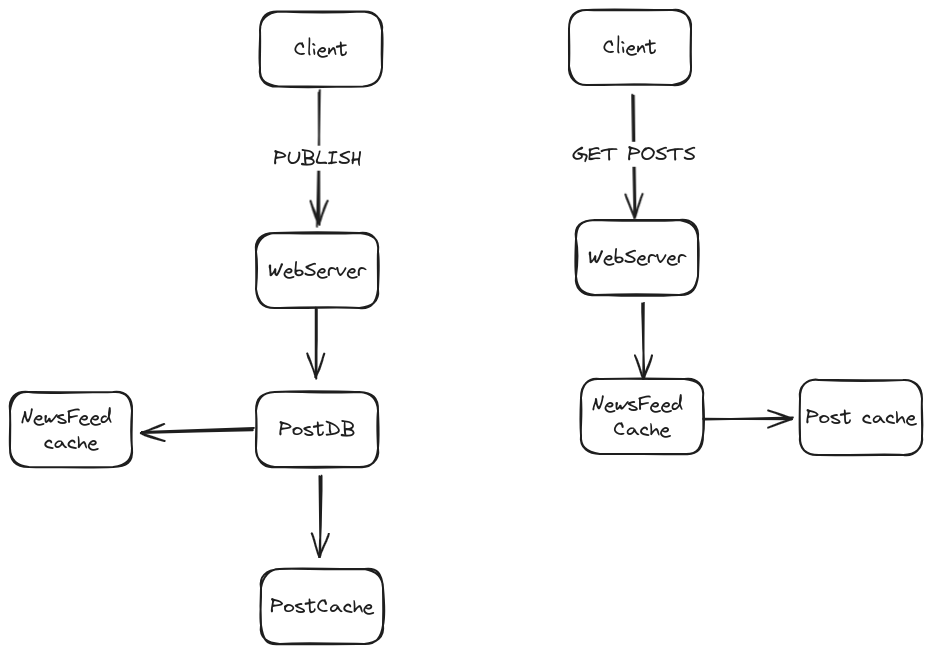

# FEED SYSTEM

## Description
A feed system in which you can publish posts and obtain posts from users you follow.

## Diagram 


# Installation

Run mysql database
```bash
docker run -d --name mysql8 -e MYSQL_ROOT_PASSWORD=111 -p 3306:3306 mysql:8
```

Run redis 
```bash
docker run -d --name my-redis -p 6379:6379 redis:latest
```

Run service
```bash
go run main.go
```

### Test using curl 

Get posts
```bash
curl http://localhost:3000/feed
```
Create post
```bash
curl -X POST -H "Content-Type: application/json" -d '{"text":"save post"}' http://localhost:3000/publish
```


