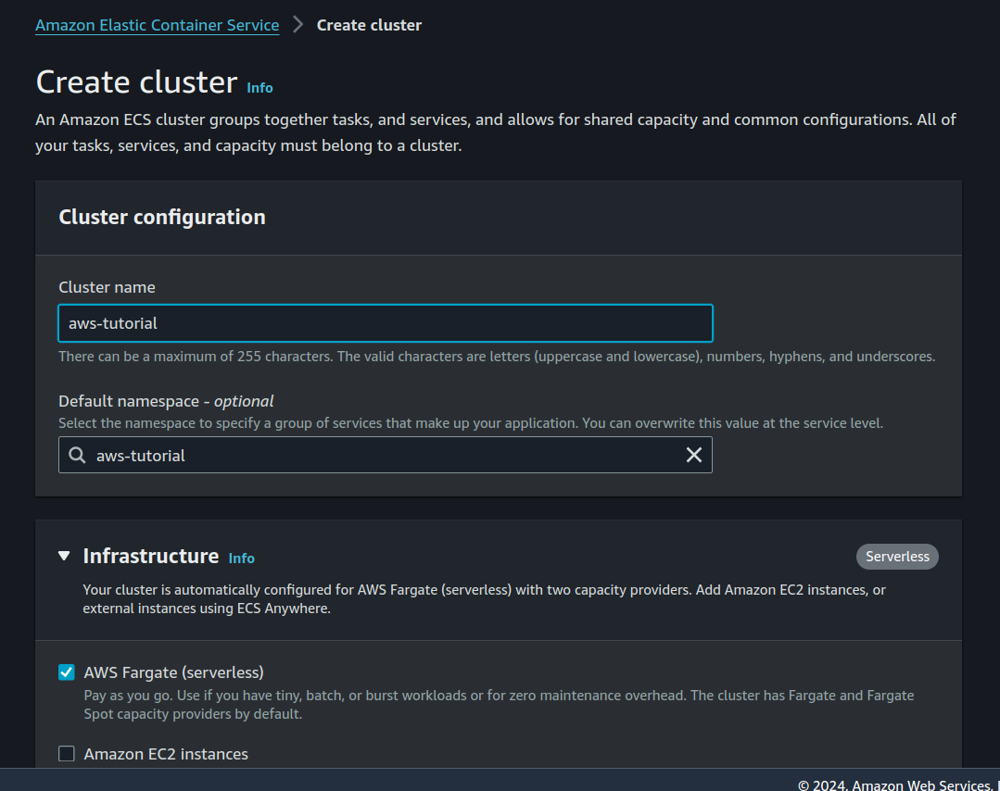
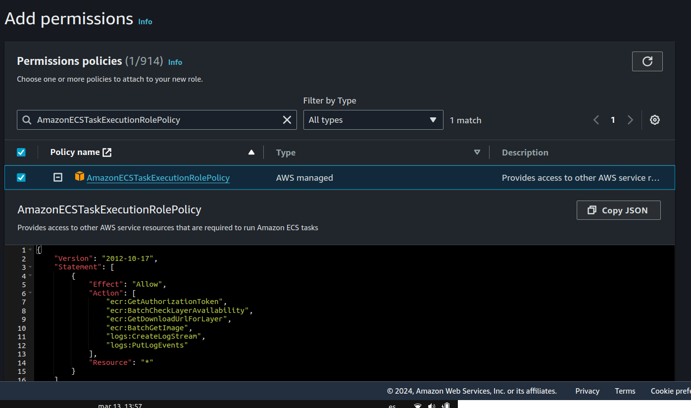
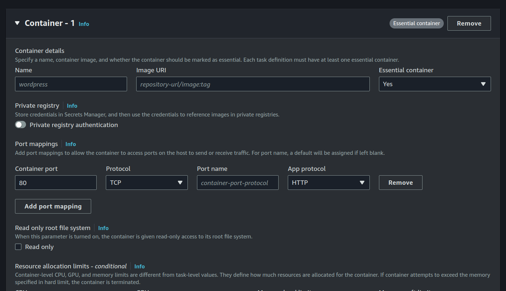
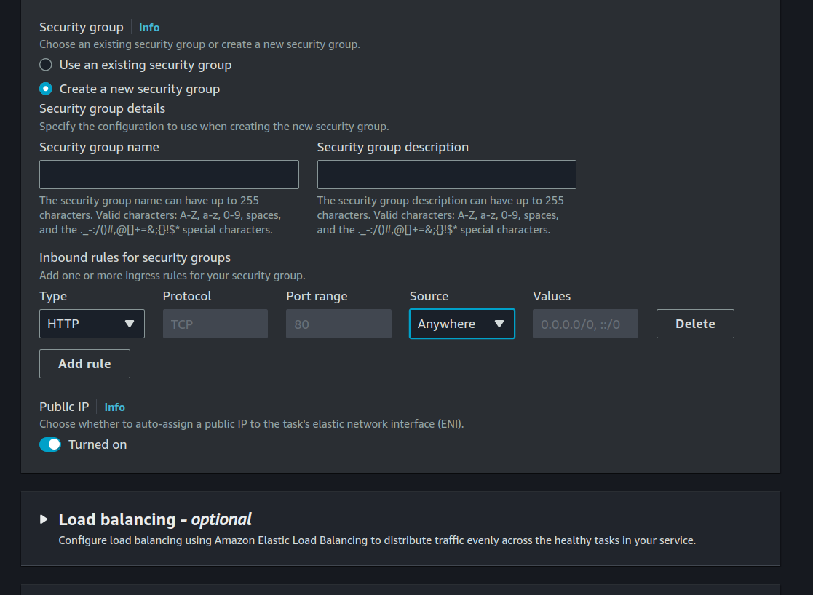
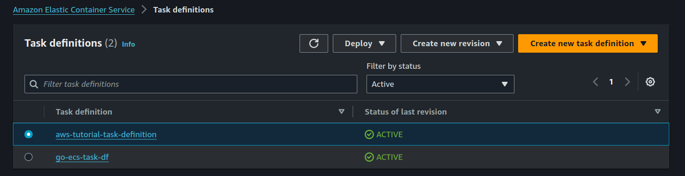
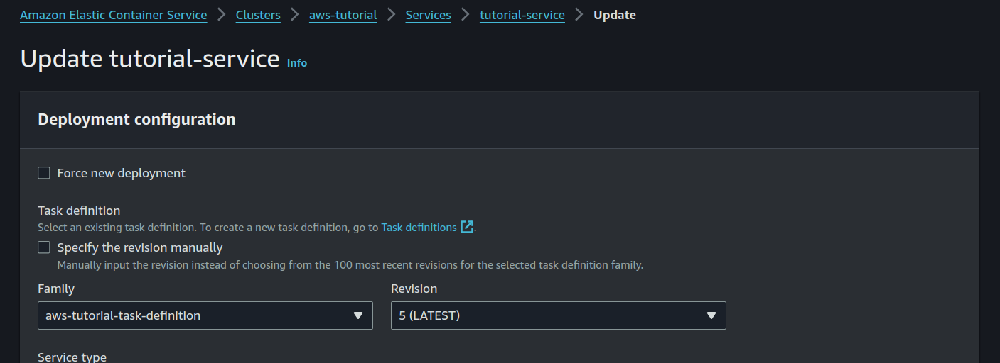

TODO

- Explain project
- Diagram architecture 
- Requirements
- Obtener access, key secret key aws, permisos
- Crear bucket input
- Crear role, execution role
- Crear security group port 80
- Crer ecs project
- Create docker image,  upload to registry
- Create task definition
- Create service
- Test version app endpint
- Test endponint save file on bucket s3
- Crear bucket output
- Crear lambda with hello world
- Crear trigger aws bucket lambda
- Use ffmpeg to convert video and save on another bucket
- ECS use load balancer


## 1. Introduction
Hi, in this tutorial we are going to create a project that allow us to upload a video using a endpoint HTTP and then convert it to another resolution format, think of this as a process that a video service like youtube o vimeo does when an user upload a video on their platform,  in order to accomplish that we are going to use the following AWS services:

S3: Simple Storage Service
We will use this service to store the videos in the original and convert resolution format,  we are going to create two different buckets for each purpose.

Elastic Container Registry:
This service is for store our docker images for the tutorial.


ECS: Elastic Container Service
We will deploy our API http using this AWS service,  this allows us to run our application in a scalable way, using container without going into the complexity of managing the infrastructure by hand.

Lambda: Serverless functions.
We will use this service to trigger a event/function when a video in the original format is uploaded to the bucket,  this will get the video and convert it to another resolution after that save that on a different bucket.


### Diagram architecture


## Requirements

- AWS account - https://aws.amazon.com/
- Docker - https://docs.docker.com/engine/install/
- Go - https://go.dev/doc/install
- AWS CLI - https://aws.amazon.com/cli/

We need to create and account on AWS in order to follow this tutorial,  
Our services, API will use golang, so we need that on our machine.
We use docker to create our images,  that images will be upload to ECR,  and run on ECS and Lambda services.
Besides we will create most of the AWS resources using the web dashboard,  we must install the AWS cli to upload the docker image.

# Create user on AWS IAM 

We need to create a user on our AWS account, this user will have an access key and a secret key that we will need later to connect to the AWS services that we will create,  also we should limit the permissions and acces to this user to only the services that they need, this is very important for security reasons and for prevent any unwanted action on our account.

On the search box of AWS dashboard search for IAM and click on the first option that appears. 
On Access management sidebar click on user section,  after that click on Create User button on main dashboard section.

On name put a name "aws-tutorail" or anything you want is not important at this point, after click on Next.

We now need to add the permissions that this user will have, we are going to add manually this settings, so check that option on the dasboard.


We need to add the following permissions policies:

#### AmazonS3FullAccess
This is required for our API services to upload files on the bucket

#### AmazonEC2ContainerRegistryFullAccess
This is required to upload our docker images to the ECR service

Use the search box and select both policies, after that click on next.


### Create acces key
After succesfuly create the user, enter on detail section of the user previously created.

Go to

**Security credentials -> Create access key**

On use cases,  select other ( AWS list other options and alternatives that we do not care at this moment ), click on Next,  you can put a description if you 
want,  after that click on Create access key.

After that you see the access key and private key on the dashboard,  copy that on some secure place of your own, this is because is the only and last time that AWS shows your private key.


# Create S3 buckets

Our application needs two buckets, one for the original file uploads and another for the convert video files,  so go to the aws dashboard and search for S3,  click on the first option that appears.


Click on create bucket, a new form configuration appears, most of the options should work fine on default values,  but we need to change the following:

AWS Region: You can selecte wherever you want, in this tutorial we are going to use us-east-2 Oregon region.

Bucket name: this must be a unique name, for this tutorial choose something that has the input name on it,  for example "tutorial-input", this semantic helps later when we have to create a trigger on a lambda function.

We mantain the select option for block all public access,  we are going to use the bucket only for our application,  so we do not need to make it public.

After that click on create bucket.


For the output bucket, repeat the same steps as before, only remember to change the name of the bucket to something like "tutorial-output".


# Create API service

For this tutorial we use golang to create our API,  we will create two endpoints, one for obtain a file from a client and save it on the input bucket, and anothe for show the current version of the application.

Start by creating a new project folder on your machine, name it ecs-tutorial,  inside that folder the following command.

```bash
go mod init ecs-tutorial
```

### Install dependencies

```bash
go get github.com/aws/aws-sdk-go
```
This is the AWS sdk that allow us to connect to different services,  in this case we are going to connect to S3 storage service

```bash
go get github.com/joho/godotenv
```
This library is util for use and .env file on our project,  we are going to use it for store our AWS credentials, version, etc.

```bash
go get github.com/go-chi/chi
```
This is a lightweight router HTTP, we are going to use it for create our API endpoints.

Create a .env file with this content.

```
AWS_S3_BUCKET=your-bucket-name
AWS_ACCESS_KEY=your-access-key
AWS_SECRET__KEY=your-secret-key
AWS_REGION=your-region
PORT=8080
```
Replaces the values with your own, the bucket the we use in this service is the "input" bucket that we created before.

Create a main.go  file with the following content.

```go
package main

import (
	"log"
	"net/http"
	"os"

	"github.com/go-chi/chi"
	"github.com/go-chi/chi/middleware"
	"github.com/joho/godotenv"
)

func uploadFileHandler(w http.ResponseWriter, r *http.Request) {
	w.Write([]byte("upload"))
}

func main() {
	err := godotenv.Load()
	if err != nil {
		panic("Error loading .env file")
	}

	r := chi.NewRouter()
	r.Use(middleware.Logger)
	r.Get("/", func(w http.ResponseWriter, r *http.Request) {
		w.Write([]byte("version 0.0.1"))
	})
	r.Post("/upload", uploadFileHandler)

	http.ListenAndServe(":"+os.Getenv("PORT"), r)
}

```

On main we first obtain the environment variables defined on .env, if that fails panic and finish program, 
after create a chi router,  we use the middleware logger for log request info, data on the console,  
lastly create two endpoints, one for the root path that show the version of the application, and another for the upload file,
the funcion uploadFileHandler is return a hardcoded string "upload" for now, later we will add the logic to save the file on the S3 bucket.

Run server

```bash
go run main.go
```

Test using curl

```bash
curl http://localhost:8080/upload
```


# Create ECR container image repository
On the AWS dashboard search for ECR and click on the first option that appears on the results, 
select private access for the image and choose any name,  for other options use the default values and click on Create Repository


We need to install the AWS cli on our machine,  this is necessary to authenticate to our AWS account and upload the image on the registry.
So follow instructions on this page besides your SO.

https://docs.aws.amazon.com/cli/latest/userguide/getting-started-install.html 


Before upload the image,  we must create a docker image of our application, for that matter create a Dockerfile file on the ecs folder.

Dockerfile

```Dockerfile
# syntax=docker/dockerfile:1

# Build the application from source
FROM golang:1.22 AS build-stage

WORKDIR /app

COPY go.mod go.sum ./
RUN go mod download

COPY *.go ./

RUN CGO_ENABLED=0 GOOS=linux go build -o /ecs-api

FROM gcr.io/distroless/base-debian11 AS build-release-stage

WORKDIR /

COPY --from=build-stage /ecs-api /ecs-api
COPY .env ./

EXPOSE 80


ENTRYPOINT ["/ecs-api"]
```

We use the multi build docker buildkit feature in this definition, 
first we create a image call build-stage,  in this setup we use the official golang 1.21 version,  copy the go.mod and go.sum files and all the files .go files that we have in our project, finally create the binary of our application using go build command.

The second image is the release image, we use the distroless base image,  this is a minimal image that only contains the necessary to run our application, this has the advantege that is more secure and lightweight than the offical,  also copy the binary create on the previous step, the .env file,  and expose the port 80 ( this is the value the we have to define on the .env file ),  the ENTRYPOINT value is the command that executes our binary.


Create image

```bash
docker build -t ecs-api .
```

Run the API server on background and expose service on port 8080

```bash
docker run -d -p 8080:80 ecs-api
```

Test service using curl

```bash
curl localhost:8080
```

That sould return the version of the API server.

#### Upload image to image registry
Go to the details of the repository that we created before, click on option "View push commands",  this show the commands that we need to execute on our machine to authenticate and upload the image to the registry.

This is the commands that we need to execute on our machine, for example something like this  .

```bash
aws ecr get-login-password --region us-west-2 | docker login --username AWS --password-stdin 99999.dkr.ecr.us-west-2.amazonaws.com

docker build -t ecs-api .

docker tag ecs-api 99999.dkr.ecr.us-west-2.amazonaws.com/aws-tutorial:v0.0.1  

docker push 99999.dkr.ecr.us-west-2.amazonaws.com/aws-tutorial:v0.0.1
```

After a successful push,  we can see the image list on the ECR aws dashboard, we see the URI of the image when, we need this value when we create a ECS service next,  so copy that value on some place.


# ECS - Create Elastic Container Service
ECS, or Amazon Elastic Container Service, is a fully managed container orchestration service provided by AWS. It allows developers to easily run, stop, and manage containers on a cluster. This service abstracts away the complexity of managing the underlying infrastructure, such as provisioning and scaling EC2 instances.

Go to the ECS section on AWS dashboard using the search box, click on Create Cluster.
Select any name you want, fot example something like "aws-tutorial",
in the Infrastructure section select the option AWS Fargate, this is a serveless feature that allow us not worry about the overhead of the maintance of the machines,  mantain the other options with the default values and click on "Create".



### Create task definition

We need to create a Task definition, this allow us to create a configuration for our  Docker containers, such as CPU, memory requirements, networking configuration, image URI, etc.

Before create that, we must created a "Task execution role",  for that matter go to 
IAM -> Access management -> Roles

Select AWS service as en entity type, in the use case select "Elasctic Container Service" -> Elastic Container Service Task click on Next.

In the permissions policies search box,  type or copy "AmazonECSTaskExecutionRolePolicy",  select that policy and click on Next.
This is permission is required to access to other AWS services required by ECS.



Enter a role name and click on Create role, remember that value , because we will need that on next section.


On the ECS dashboard, click on "Task Definitions" sidebar, after go to "Create new Task Definition".
This is a very long form, with more of the options we will stick with the default values, but we need to change the following:

Task definition family:
Put a name for the task definition, for example "aws-tutorial-task"


Infrastructure requirements:
On Launch type select AWS Fargate Serverless,

Operating system/Architecture:
Select Linux/x86_64, this is the architecture of our docker image.

**Task size**:

Because this is a tutorial we are going to use the minimum values,  so put 1GB for memory and 0.5 vCPU, change this values if you need more resources for your application.

**Task execution role**:

Select the role that we created before,  this is required for pulls a image for ECR, save logs to CloudWatch and other actions that required ECS in order to works.

**Container details**:

Image URI:
Select the URI of the image the we upload to ECR before.

Port mappings:
Check this specific values.
port: 80

Protocol: TCP

App protocol: HTTP

Leaves the other containers configurations with the default values.


Storage, Monitoring and Tags are optional, so we can skip that sections and click on Create




### Create service ECS

On ECS dashboard, select the cluster the we created before,  go on service tabs and click on "Create" button.

Environment configuration:

**Application type**:

Choose Service option, this is a best fit for our type of API long running application.

**Task definition**:

On Family select the Task definition that we created in the previous step,
revisiion should selecte the last version of our task, 

**Service Name**:

Put a name for the service, for example "aws-tutorial-service"

**Service type**;

Choose replica ,this allow us to run multiple copies of our application,  and ECS will manage the load balancing and scaling for us.


#### Networking
On this section leave the VPC with the default values

**Security group**:

Our services run on HTTP port 80, for that reasons we must create a new config with and onbound rule.

Make sure that public IP on turned on, this is because we are not goind to use a Load Balancer in this tutorial,  so we need to access our service using the public IP of the machine.



Leave other options with default values and click on "Create"

On the cluster section, click on the Task tab service and go to the task attached to the service.

On the task detail, look up for the PublicIP , test using curl

```bash
curl http://yourip/
```
That should return the api version response of our API service.


# Update API service 

In order to uplaod a file to a S3 bucket we need to update our handler uploadFileHandler with this code.

```go

import (
	"bytes"
	"context"
	"fmt"
	"io"
	"log"
	"net/http"
	"os"
	"time"

	"github.com/aws/aws-sdk-go/aws"
	"github.com/aws/aws-sdk-go/aws/awserr"
	"github.com/aws/aws-sdk-go/aws/credentials"
	"github.com/aws/aws-sdk-go/aws/request"
	"github.com/aws/aws-sdk-go/aws/session"
	"github.com/aws/aws-sdk-go/service/s3"
	"github.com/go-chi/chi"
	"github.com/go-chi/chi/middleware"
	"github.com/joho/godotenv"
)

func uploadFileHandler(w http.ResponseWriter, r *http.Request) {
	// 10MB maximum file size
	err := r.ParseMultipartForm(10 << 20)
	if err != nil {
		http.Error(w, "Failed to parse multipart form", http.StatusBadRequest)
		return
	}

	file, fileHeader, err := r.FormFile("file")
	if err != nil {
		http.Error(w, "Failed to retrieve file from form data", http.StatusBadRequest)
		return
	}
	defer file.Close()

	fileBytes := bytes.Buffer{}
	_, err = io.Copy(&fileBytes, file)
	if err != nil {
		http.Error(w, "Failed to read file content", http.StatusInternalServerError)
		return
	}

	err = uploadToS3(fileHeader.Filename, bytes.NewReader(fileBytes.Bytes()))
	if err != nil {
		http.Error(w, "Failed to upload file to S3", http.StatusInternalServerError)
		return
	}

	w.WriteHeader(http.StatusOK)
	w.Write([]byte("File uploaded successfully"))
}

func uploadToS3(name string, fileContent io.ReadSeeker) error {
	bucket := os.Getenv("AWS_S3_BUCKET")
	key := os.Getenv("AWS_ACCESS_KEY")
	secret := os.Getenv("AWS_SECRET_KEY")
	timeout := 1000 * time.Second

	sess := session.Must(session.NewSession(&aws.Config{
		Region:      aws.String(os.Getenv("AWS_REGION")),
		Credentials: credentials.NewStaticCredentials(key, secret, ""),
	}))

	svc := s3.New(sess)

	ctx := context.Background()
	var cancelFn func()
	if timeout > 0 {
		ctx, cancelFn = context.WithTimeout(ctx, timeout)
	}

	if cancelFn != nil {
		defer cancelFn()
	}

	_, err := svc.PutObjectWithContext(ctx, &s3.PutObjectInput{
		Bucket:             aws.String(bucket),
		Body:               fileContent,
		Key:                aws.String(name),
		ContentDisposition: aws.String("attachment"),
	})
	if err != nil {
		if aerr, ok := err.(awserr.Error); ok && aerr.Code() == request.CanceledErrorCode {
			fmt.Fprintf(os.Stderr, "upload canceled due to timeout, %v\n", err)
			return err
		} else {
			fmt.Fprintf(os.Stderr, "failed to upload object, %v\n", err)
			return err
		}
	}

	return nil
}

```


On the handler code, we first set a size limit for the file that client size of 10 MB,  after we check if the value form-data exists on the request and response a message if error exists.

Next we copy the value of file content on a variable on type Buffer bytes, check erros and if everything is ok call a function call 
uploadToS3,  this function recieve two parameters.

name: this is the filename of the file the the client upload.
fileContent:  this is a file object content that we are going to upload to S3, we need to convert the bytes to a Reader type in order to implement the io.ReadSeeker interface required by the AWS sdk.

We create a new AWS session using the AWS_ACCESS_KEY  and the AWS_SECRET_KEY, next create a context with a timeout of 60 that we use when we call the PutObjectWithContext method,  this receives a bucket name, file content and the name of file, after that we check if the operation has and error and returns and error if that happened.

#### Upload new image to ECR

```bash
docker build -t ecs-api .
docker tag ecs-api 99999.dkr.ecr.us-west-2.amazonaws.com/aws-tutorial:v0.0.2
docker push 99999.dkr.ecr.us-west-2.amazonaws.com/aws-tutorial:v0.0.2
```

We must create a new task definition with the new image version, go to Task Definition -> Create New Revision,  search the container config and change the value of the Image URI with the new image version.



After that, go to cluster -> service -> update service.

on this section, make sure that the revision is the latest value of the task definition and click on Update, 
after a few seconds we should see the new version deployed.



Check on the task detail the public IP and test using curl

```bash
curl -X POST -F "file=@./Screenshot from 2024-02-12 14-11-19.png" http://yourip/upload
```


