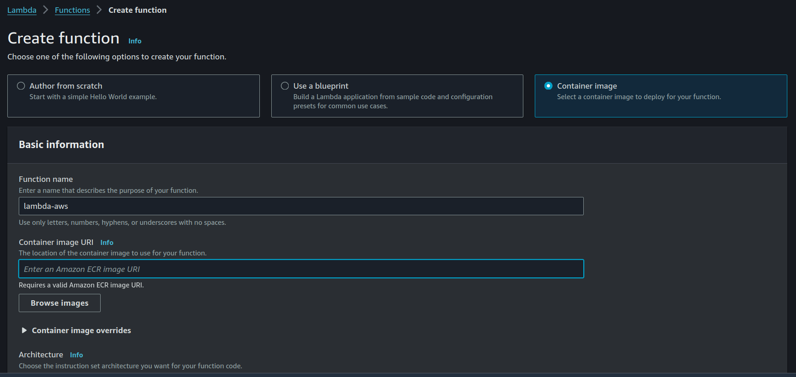
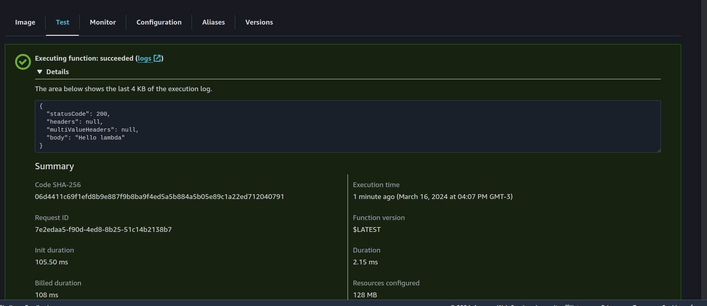
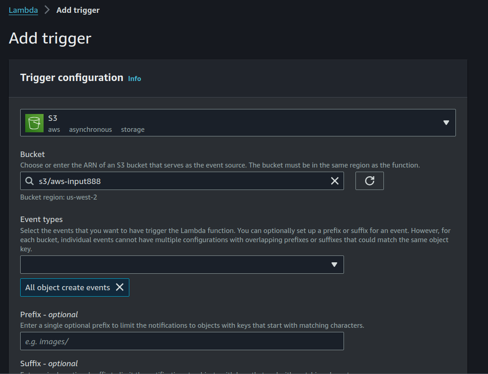
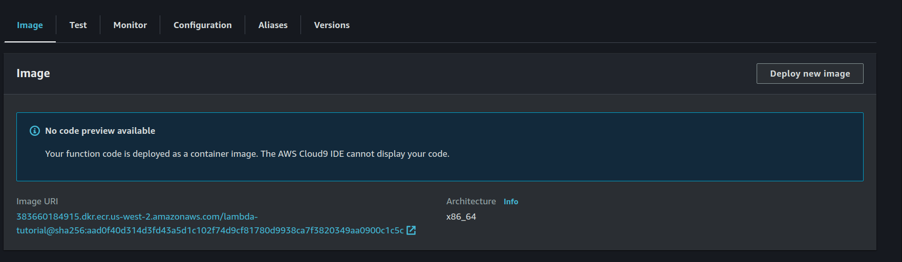
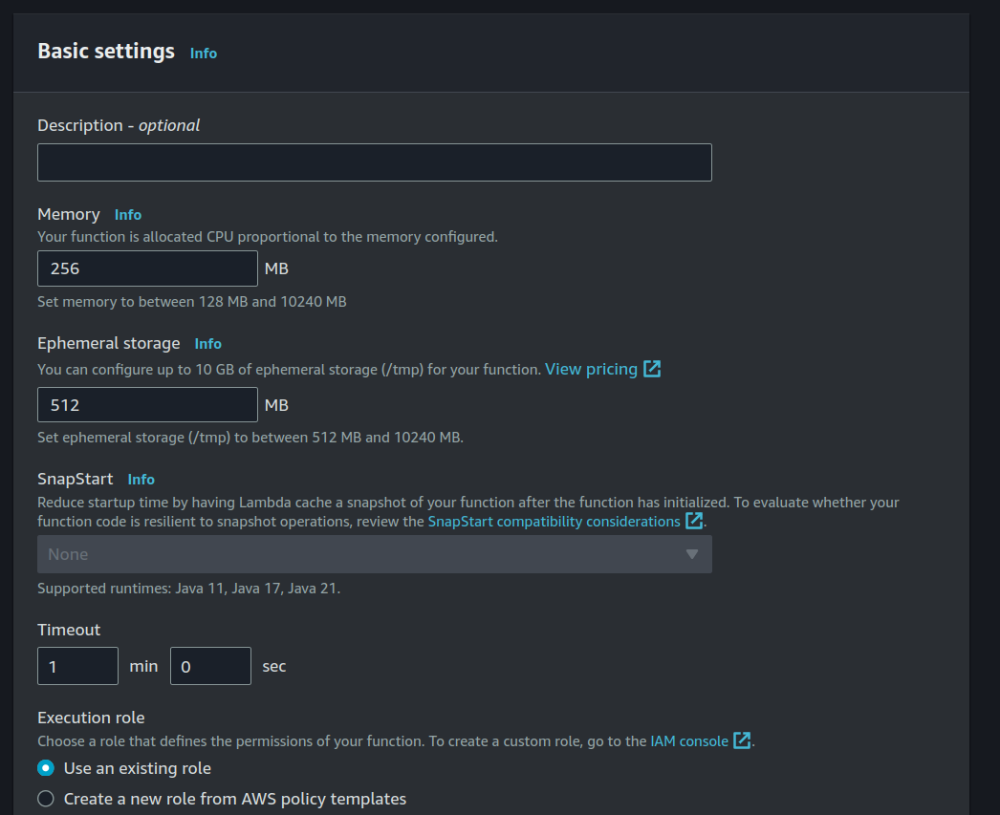
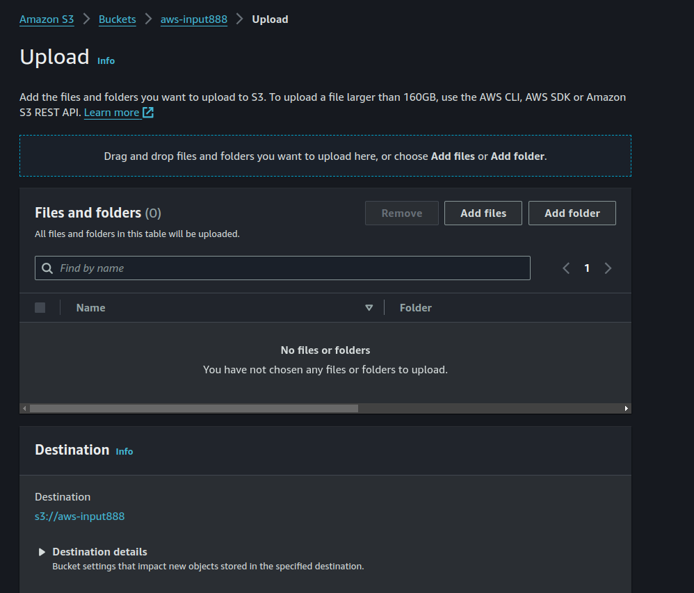
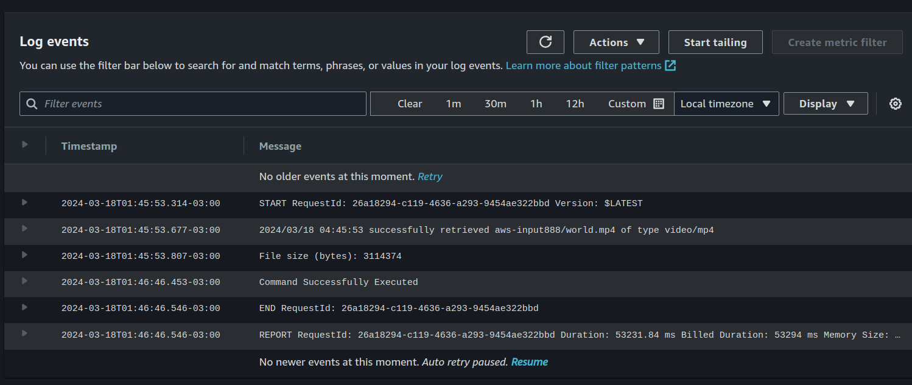

## 1. Introduction
Hi, in this tutorial we are going to create a project that allow us to upload a video using a endpoint HTTP and then convert it to another resolution format using another service , think of this as a process that a video platform like youtube o vimeo does when an user upload a video on their servers,  in order to accomplish that we are going to use the following AWS services:

**S3 Simple Storage Service:** 
We will use this service to store the videos in the original format and also in a compresses format, we are going to create two different buckets for each purpose.

**Elastic Container Registry:** 
This service is for store our docker container images that will be use on ECS and lambda services.

**ECS Elastic Container Service:**
We will deploy our API http using ECS,this allows us to run our application in a scalable way without going into the complexity of managing the infrastructure manually, we will use containers to package our API service,

**Lambda Serverless functions:**
We will use this service to trigger a event/function when a video in the original format is uploaded to a bucket,  this will obtain the video and convert it to another resolution ( using ffmpeg )  after save it on a different output bucket.

> AFTER CREATED AND USE/TEST THE SERVICES, BE SURE TO DELETE THAT SERVICES FROM THE AWS DASHBOARD IN ORDER TO AVOID UNWANTED CHARGES.


- Introduction
- Create user on AWS IAM
- Create S3 buckets
- Create API service
- Create ECR container image repository
- Create ECS Elastic Container Service
- Update API service
- Create lambda container
- Create lambda service
- Conclusion

### Diagram architecture


## Requirements

- AWS account - https://aws.amazon.com/
- Docker - https://docs.docker.com/engine/install/
- Go - https://go.dev/doc/install
- AWS CLI - https://aws.amazon.com/cli/

We need to create an account in AWS in order to follow this tutorial,  
Our services, API will use golang, so we need that on our machine.
We use docker to create our images,  that images will be upload to ECR,  and run on ECS and Lambda services.
Besides we will create most of the AWS resources using the web dashboard,  we must install the AWS cli to upload the docker image.

# Create user on AWS IAM 

We need to create an user for this tutorial in AWS, this user will have an ACCESS KEY and a SECRET KEY that we will need later to connect to the AWS services that required our project,  also we should limit the permissions and acces to this user to the specifics services that we need, this is very important for security reasons and for prevent any unwanted action on our account.

On the search box of AWS dashboard search for IAM and click on the first option that appears. 


On IAM section go to.

**Sidebar -> Access management -> Users -> Add user**


On name put a name "aws-tutorial" or anything you want is not important at this point, after click on Next.

We now need to add the permissions that this user will have, we are going to add manually this settings, so check that option on the dasboard.


We need to add the following permissions policies:

#### AmazonS3FullAccess
This is required for our API services to upload files on S3 bucket.

#### AmazonEC2ContainerRegistryFullAccess
This is required to upload our docker images to the ECR service

Use the search box and select both policies, after that click on next.


### Create acces key
After succesfuly create the user, enter on detail section of the user previously created.

Go to

**Security credentials -> Create access key**

On use cases,  "SELECT OTHER"( AWS list other options and alternatives that we do not care at this moment ), click on Next,  you can put a description if you 
want,  after that click on Create access key.

After that you see the access key and private key on the dashboard,  copy that on some secure place of your own, this is because is the last time that AWS shows your private key, we need those values when we create our API and lambda services.


# Create S3 buckets

Our project needs two buckets, one for the original video upload and another for the compress video files, for that go to the AWS dashboard and search for S3,  click on the first option that appears.

Click on create bucket, a new form configuration appears, most of the options should work fine on default values, but we need to change the following options:

**AWS Region:** You can select any region you want, in this tutorial we are going to use "us-east-2 Oregon" region.

**Bucket name:** this must be a unique name, for this tutorial choose something that has the input name on it, for example "bucket-input", this semantic helps later when we create a trigger in the lambda server configuration.

We mantain the select option for "block all public access",  we are going to access the bucket only by ours services, so we do not need to make it public.

After that click on create bucket.


For the second bucket who is the recipe for the compress videos, repeat the same steps as before, only remember to change the name for something like "bucket-output".


# Create API service

For this tutorial we use golang to develop our API, we will create two endpoints, one that is in charge to received a file from a client and later save it on the bucket-input and another to show the API version text.

First a new project folder on your machine, name it ecs-tutorial,  inside that folder run the following command.

```bash
go mod init ecs-tutorial
```


### Install dependencies

```bash
go get github.com/aws/aws-sdk-go@v1.50.35
go get github.com/joho/godotenv@v1.5.1
go get github.com/go-chi/chi
```

**aws-sdk:** This is the AWS sdk that allow us to connect to different AWS services, in this case we are going to connect to S3 storage.

**godotenv:** This library allow us to use environment file (.env), we are going to use it for store our AWS credentials, version, port etc.

**chi:** This is a lightweight router HTTP, we are going to use it for create our API endpoints.


Start creating a .env file with this content.

```
AWS_S3_BUCKET=your-bucket-name
AWS_ACCESS_KEY=your-access-key
AWS_SECRET__KEY=your-secret-key
AWS_REGION=your-region
PORT=80
```
Replaces the values with your own, the bucket the we use in this service is the "input" bucket that we created before.

Create a main.go  file with the following content.

```go
package main

import (
	"log"
	"net/http"
	"os"

	"github.com/go-chi/chi"
	"github.com/go-chi/chi/middleware"
	"github.com/joho/godotenv"
)

func uploadFileHandler(w http.ResponseWriter, r *http.Request) {
	w.Write([]byte("upload"))
}

func main() {
	err := godotenv.Load()
	if err != nil {
		panic("Error loading .env file")
	}

	r := chi.NewRouter()
	r.Use(middleware.Logger)
	r.Get("/", func(w http.ResponseWriter, r *http.Request) {
		w.Write([]byte("version 0.0.1"))
	})
	r.Post("/upload", uploadFileHandler)

	http.ListenAndServe(":"+os.Getenv("PORT"), r)
}

```

In the main function we first obtain the environment variables defined in the .env file, if that fails panic and stop the process, 
after create a chi router object,  we use the middleware logger for log server request info,  that is helpful it on the terminal, lastly create two endpoints, one for the root path that show the version of the application, and another for the upload file,
at the moment funcion uploadFileHandler is return a hardcoded string "upload", later we will add the logic to save the file on the S3 bucket.


# Create ECR container image repository

### Create docker image

Before upload the image,  we must create a docker image of our application, for that matter create a Dockerfile file on the ecs folder.

Dockerfile

```Dockerfile
# syntax=docker/dockerfile:1

# Build the application from source
FROM golang:1.22 AS build-stage

WORKDIR /app

COPY go.mod go.sum ./
RUN go mod download

COPY *.go ./

RUN CGO_ENABLED=0 GOOS=linux go build -o /ecs-api

FROM gcr.io/distroless/base-debian11 AS build-release-stage

WORKDIR /

COPY --from=build-stage /ecs-api /ecs-api
COPY .env ./

EXPOSE 80


ENTRYPOINT ["/ecs-api"]
```

We use the multi build docker buildkit feature in this definition, 
first we create a image call build-stage,  in this setup we use the official golang 1.21 version, next copy the go.mod and go.sum files and all the files .go that we have in our project, finally create the binary of our application using the go build command.

The second image is the release image, we use a distroless base image,  this is a minimal image that only contains the necessary components to run our application, this has the advantege to be more secure and lightweight, next copy the binary create on the previous step, the .env file, and expose the port 80 ( this is the value the we have to define on the .env file ),  the ENTRYPOINT value is the command that executes our binary.


Create image

```bash
docker build -t ecs-api .
```

Run the API server on background and expose service on port 8080

```bash
docker run -d -p 8080:80 ecs-api
```

Test service using curl

```bash
curl localhost:8080
```

That sould return the version of the API server.


### Create ECR repository

On the AWS dashboard search for ECR and click on the first option that appears on the results, 
select private access for the image and choose any name,  for other options use the default values and click on Create Repository


We need to install the AWS cli on our machine,  this is necessary to authenticate to our AWS account and upload the image on the registry.
So follow instructions on this page according to your OS.

https://docs.aws.amazon.com/cli/latest/userguide/getting-started-install.html 


#### Upload image to image registry
Go to the details of the repository that we created before, click on button "View push commands", this shows the commands that we need to execute on our machine to authenticate and upload our image in the registry.

You should see something like this.

```bash
aws ecr get-login-password --region us-west-2 | docker login --username AWS --password-stdin 99999.dkr.ecr.us-west-2.amazonaws.com

docker build -t ecs-api .

docker tag ecs-api yourawsuri:v0.0.1  

docker push yourawsuri:v0.0.1
```

After a successful push,  we should see the image in the ECR aws dashboard,  copy the value of the image URI , we need this when we create a ECS service, so copy that value on some place.


# ECS - Create Elastic Container Service
> ECS, or Amazon Elastic Container Service, is a fully managed container orchestration service provided by AWS. It allows developers to easily run, stop, and manage containers on a cluster. This service abstracts away the complexity of managing the underlying infrastructure, such as provisioning and scaling EC2 instances.

Go to the ECS section on AWS dashboard using the search box, click on Create Cluster,  select any name you want, for example something like "ecs-tutorial",
in the Infrastructure section select the option AWS Fargate, this is a serveless feature that allow us not worry about the overhead of the maintance of the machines,  mantain the other options with the default values and click on "Create".


### Create task definition

We need to create a Task definition, this allow us to create a configuration for our Docker containers, such as CPU, memory, networking , image URI, etc.

Before that we must generate a  "Task execution role",  for that matter go to 

**IAM -> Access management -> Roles**

Select AWS service as en entity type, in the use case select **"Elasctic Container Service" -> Elastic Container Service Task** click on Next.

In the permissions policies search box,  type or copy "AmazonECSTaskExecutionRolePolicy",  select that policy and click on Next.
This permission is required by our ECS cluster to create and have access to other AWS services.


Enter a role name and click on Create role, remember that value , because we will need that on next section.


On the ECS dashboard, click on **Task Definitions** sidebar, after go to **Create new Task Definition**, 
This is a very long form, for most of the options we use the default value, but we need to change the following:

**Task definition family:** Put a name for the task definition, for example "aws-tutorial-task"

**Infrastructure requirements:** On Launch type select AWS Fargate Serverless,

**Operating system/Architecture:** Select Linux/x86_64, this is the architecture of our docker image.

**Task size:** Because this is a tutorial we are going to use the minimum values,  so put 1GB for memory and 0.5 vCPU, change this values if you need more resources for your application.

**Task execution role:** Select the role that we created before,  this is required for pulls them image for ECR, save logs to CloudWatch and other actions that required ECS to work properly.

### Container details

**Image URI:** Select the URI of the image the we upload to ECR before.

**Port mappings:** Check this specific values.

**port:** 80

**Protocol:** TCP

**App protocol:** HTTP

Leaves the other containers configurations with the default values.


Storage, Monitoring and Tags are optional, so we can skip that sections and click on Create


### Create service ECS

On ECS dashboard, select the cluster the we created before,  go on service tabs and click on "Create" button.

Environment configuration:

**Application type**: Choose Service option, this is a best fit for our type of API long running application.

**Task definition**: On Family select the Task definition that we created in the previous step,
revisiion should selecte the last version of our task, 

**Service Name**: Put a name for the service, for example "aws-tutorial-service"

**Service type**; Choose replica ,this allow us to run multiple copies of our application,  and ECS will manage the load balancing and scaling for us.


### Networking
On this section leave the VPC with the default values

**Security group**: Our services run on HTTP port 80, for that reasons we must create a new config with and onbound rule.

Make sure that public IP on turned on, this is because we are not going to use a Load Balancer in this tutorial,  so we need to access our service using the public IP of the service.


Leave other options with default values and click on "Create"

Wait a moment and go to the cluster section, click on the Task tab service and go to the task attached to the service.

On the task detail, look up for the Public IP , you can test using curl

```bash
curl http://yourip/
```
That should return the api version response of our API service.


# Update API service 

In order to upload a file to a S3 bucket we need to update our handler uploadFileHandler with the following code.

```go

import (
	"bytes"
	"context"
	"fmt"
	"io"
	"log"
	"net/http"
	"os"
	"time"

	"github.com/aws/aws-sdk-go/aws"
	"github.com/aws/aws-sdk-go/aws/awserr"
	"github.com/aws/aws-sdk-go/aws/credentials"
	"github.com/aws/aws-sdk-go/aws/request"
	"github.com/aws/aws-sdk-go/aws/session"
	"github.com/aws/aws-sdk-go/service/s3"
	"github.com/go-chi/chi"
	"github.com/go-chi/chi/middleware"
	"github.com/joho/godotenv"
)

func uploadFileHandler(w http.ResponseWriter, r *http.Request) {
	// 10MB maximum file size
	err := r.ParseMultipartForm(10 << 20)
	if err != nil {
		http.Error(w, "Failed to parse multipart form", http.StatusBadRequest)
		return
	}

	file, fileHeader, err := r.FormFile("file")
	if err != nil {
		http.Error(w, "Failed to retrieve file from form data", http.StatusBadRequest)
		return
	}
	defer file.Close()

	fileBytes := bytes.Buffer{}
	_, err = io.Copy(&fileBytes, file)
	if err != nil {
		http.Error(w, "Failed to read file content", http.StatusInternalServerError)
		return
	}

	err = uploadToS3(fileHeader.Filename, bytes.NewReader(fileBytes.Bytes()))
	if err != nil {
		http.Error(w, "Failed to upload file to S3", http.StatusInternalServerError)
		return
	}

	w.WriteHeader(http.StatusOK)
	w.Write([]byte("File uploaded successfully"))
}

func uploadToS3(name string, fileContent io.ReadSeeker) error {
	bucket := os.Getenv("AWS_S3_BUCKET")
	key := os.Getenv("AWS_ACCESS_KEY")
	secret := os.Getenv("AWS_SECRET_KEY")
	timeout := 1000 * time.Second

	sess := session.Must(session.NewSession(&aws.Config{
		Region:      aws.String(os.Getenv("AWS_REGION")),
		Credentials: credentials.NewStaticCredentials(key, secret, ""),
	}))

	svc := s3.New(sess)

	ctx := context.Background()
	var cancelFn func()
	if timeout > 0 {
		ctx, cancelFn = context.WithTimeout(ctx, timeout)
	}

	if cancelFn != nil {
		defer cancelFn()
	}

	_, err := svc.PutObjectWithContext(ctx, &s3.PutObjectInput{
		Bucket:             aws.String(bucket),
		Body:               fileContent,
		Key:                aws.String(name),
		ContentDisposition: aws.String("attachment"),
	})
	if err != nil {
		if aerr, ok := err.(awserr.Error); ok && aerr.Code() == request.CanceledErrorCode {
			fmt.Fprintf(os.Stderr, "upload canceled due to timeout, %v\n", err)
			return err
		} else {
			fmt.Fprintf(os.Stderr, "failed to upload object, %v\n", err)
			return err
		}
	}

	return nil
}

```


On the handler code, we first set a size limit of 10MB for the file the the client send,  after we check if the value form-data exists on the request and response a specific message if error exists.

Next we copy the value of file content on a variable on type Buffer bytes, check for errors and if everything is ok call a function named
uploadToS3,  this function recieve two parameters.

**name:** this is the name of the file the the client upload.

**fileContent:**  this is a file object content that we are going to upload to S3, we need to convert the bytes to a Reader type in order to implement the io.ReadSeeker interface required by the AWS sdk.

We create a new AWS session using the AWS_ACCESS_KEY and the AWS_SECRET_KEY environment variables, next create a context with a timeout of 60 that we use when we call the PutObjectWithContext method,  this receives a bucket name, file content and the name of file, after that we check if the operation fails and returns and error if that happened.

#### Upload new image to ECR

```bash
docker build -t ecs-api .
docker tag ecs-api youtawsuri:v0.0.2
docker push youtawsuri:v0.0.2
```

Back in the ECS dashboard, we e must create a new task definition with the new image version, go to **Task Definition -> Create New Revision**, search the container config and change the value of the Image URI with the new image version.


After that, go to **cluster -> service -> update service**.

on this section, make sure that the revision is the latest value of the task definition and click on Update, 
after a few seconds we should see the new version deployed.


Check on the task detail the public IP and check using curl

```bash
curl -X POST -F "file=@./yourimage.png" http://yourip/upload
```

If this works correctly, you can check the file upload on the S3 input-bucket aws dasboard.


# Create lambda container
We are going to create a container that will be running on lambda function on AWS, this code will be called when we upload a video file on the input aws bucket.

Create a new folder call lambda on your machine and enter on that folder.

Init project

```go
go mod init lambda-tutorial
```

Install dependencies

```go
go get github.com/aws/aws-lambda-go@v1.46.0
go get github.com/aws/aws-sdk-go@v1.50.35
go get github.com/joho/godotenv@v1.5.1
```


Create a main.go file with the following content.

```go
package main

import (
	"context"

	"github.com/aws/aws-lambda-go/events"
	"github.com/aws/aws-lambda-go/lambda"
)

func handler(ctx context.Context, event events.APIGatewayProxyRequest) (events.APIGatewayProxyResponse, error) {
	response := events.APIGatewayProxyResponse{
		StatusCode: 200,
		Body:       "Hello lambda",
	}
	return response, nil
}

func main() {
	lambda.Start(handler)
}
```
On main we call the Star method of the lambda sdk, this method requires a function call "handler" that will be executed when the lambda function is invoked, this set a status code 200 and a text response "Hello lambda", we use this mock example to test if it is working correctly using a container.


Create a Dockerfile with this content

```Dockerfile
FROM golang:1.22 as build
WORKDIR /lambda
COPY go.mod go.sum ./
COPY main.go .
RUN go build -tags lambda.norpc -o main main.go

FROM public.ecr.aws/lambda/provided:al2023
COPY --from=build /lambda/main ./main
ENTRYPOINT [ "./main" ]
```
We use a multi-stage approach,  first we define a build stage using a golang:1.22 image copy the required files, go.mod, go.sum, main.go and build the binary of our lambda function,  next we use the a AWS official lambda image, this is required in order to work in the context of a lambda function,  copy the binary from the build stage en set the entrypoint command.


Build image

```bash
docker build -t lambda-tutorial .
```

Create container to test

```bash
docker run -d -p 9000:8080 \
--entrypoint /usr/local/bin/aws-lambda-rie \
lambda-tutorial ./main
```

Test using curl

```bash
curl -XPOST "http://localhost:9000/2015-03-31/functions/function/invocations" -d '{}'
```
The sould return this 

```json
{"statusCode":200,"headers":null,"multiValueHeaders":null,"body":"Hello lambda"}
```

#### Upload image to ECR
On the ECR aws dashboard,  create a new private repository called "lambda-tutorial" or something similar.

Build and upload the image to the registry, check view push commands on detail image.

```bash
docker build -t lambda-tutorial:v0.0.1 .
docker tag lambda-tutorial:v0.0.1 yourURI/lambda-tutorial:v0.0.1
```


# Create lambda service

AWS Lambda is a serverless computing service that allows you to run code without provisioning or managing servers. It enables you to execute your code in response to various events, such as changes to data in S3 buckets, updates to DynamoDB tables, HTTP requests via API Gateway, or custom events generated by your applications.

### Create policy

IAM -> Access management -> Policies -> Create policy

On policiy editor section select JSON and paste this code 

```json
{
    "Version": "2012-10-17",
    "Statement": [
        {
            "Effect": "Allow",
            "Action": [
                "logs:PutLogEvents",
                "logs:CreateLogGroup",
                "logs:CreateLogStream"
            ],
            "Resource": "arn:aws:logs:*:*:*"
        },
        {
            "Effect": "Allow",
            "Action": [
                "s3:GetObject"
            ],
            "Resource": "arn:aws:s3:::*/*"
        }
    ]
}
```

This definition allow the lambda function to access to the Watch logs and S3  AWS services requires by our lambda application.

Click on next, put a name like "lambda-tutorial-policy" and press on Create policy button.


### Create role

Go to IAM -> Access management -> Roles -> Create role,  select AWS service as entity type,  in the use case select Lambda and click on next.

On the permissions section,  search the policy the we created before "lambda-tutorial-policy", select that and click on next.

On role detail select a name for the role, for example "lambda-tutorial-role" and click on Create role.


### Create lambda function

On the AWS dashboard go to the lambda section,  make sure to select the same region that we use in the S3 bucket section ( in our case "us-west-2 - Oregon") , in order to get the trigger working correctly this is a must.



Select container image, put a name,  and in the image URI you can put the value by hand or click on the browse images and browse for the image.

On Change default execution role,  select Use an existing role and choose the execution role that we created before "lambda-tutorial-role".

Wait a moment and the lambda function should be created, in order to check our container application , go to Test section and click on "Test" button,  this should return the response "Hello lambda" that we define on the lambda function.




#### Add trigger s3 

We need to configure our lambda to triggers when a file is upload to a S3 bucket,  for that reason go to the lambda detail and click on Add Trigger,

On Trigger configuration, select S3 as a trigger type, on the bucket select the S3 created on the first section of this tutorial, be sure to select the input purpose bucket, leave default values on the other options and click on Add.




### Update dockerfile 

We need to install the ffmepg on our container to convert the video file to another resolution, add this new code on Dockerfile

```Dockerfile
FROM golang:1.22 as build
WORKDIR /helloworld
COPY go.mod go.sum ./
COPY main.go .
RUN go build -tags lambda.norpc -o main main.go

FROM public.ecr.aws/lambda/provided:al2023
RUN dnf -y install wget && dnf -y install tar && dnf -y install xz && \ 
    cd /usr/local/bin && \
    mkdir ffmpeg && \ 
    cd ffmpeg && \
    wget https://www.johnvansickle.com/ffmpeg/old-releases/ffmpeg-4.2.1-amd64-static.tar.xz && \
    tar xvf ffmpeg-4.2.1-amd64-static.tar.xz && \
    ln -s /usr/local/bin/ffmpeg/ffmpeg-4.2.1-amd64-static/ffmpeg /usr/bin/ffmpeg
COPY .env .env
COPY --from=build /helloworld/main ./main
ENTRYPOINT [ "./main" ]
```

On the lambda image, we add a new RUN command,  in this we update some dependencies.
wget: required to download ffmpeg bin file.
tar, xz: required to extract the file.

After installed that dependencies, we download the ffmpeg binary file using wget, extract the file and create a symbolic link to the /usr/bin/ffmpeg path,  this is required in order to call the ffmpeg from our golang code.

Add .env file with the definition of the required environemnt variables
```
AWS_S3_BUCKET=your-output-bucket
AWS_ACCESS_KEY=your-access-key
AWS_SECRET__KEY=your-secret-key
AWS_REGION=your-region
```

Update lambda/main.go

```go
func convertFile(inputFile string, outputFile string) error {
	out, err := exec.Command("ffmpeg", "-i", inputFile, "-vf", "scale=640:480", outputFile).Output()

	if err != nil {
		fmt.Printf("ffmpeg command error:  %s", err)
		return err
	}

	fmt.Println("Command Successfully Executed")
	return nil
}
```

In this function we received as parameters the path string of the input and output video files that we use in a ffmepg call,  this command compress the original video file that we upload to the input-bucket,  this is a very basic command that we use for this tutorial, ffmpeg has a lot of options and configurations for different resolutions and formats,  you can check the documentation for more information.

https://img.ly/blog/ultimate-guide-to-ffmpeg/#video-properties

Finally check for an error command and return that value of nil is everything is ok.

```go
func handlerTriggerS3Bucket(ctx context.Context, s3Event events.S3Event) error {
	err := godotenv.Load()
	if err != nil {
		log.Fatal("Error loading .env file")
	}

	bucketOutput := os.Getenv("AWS_S3_BUCKET")
	key := os.Getenv("AWS_ACCESS_KEY")
	secret := os.Getenv("AWS_SECRET_KEY")
	region := os.Getenv("AWS_REGION")
	timeout := 1000 * time.Second

	sess := session.Must(session.NewSession(&aws.Config{
		Region:      aws.String(region),
		Credentials: credentials.NewStaticCredentials(key, secret, ""),
	}))

	svc := s3.New(sess)
	var cancelFn func()
	if timeout > 0 {
		ctx, cancelFn = context.WithTimeout(ctx, timeout)
	}

	if cancelFn != nil {
		defer cancelFn()
	}

	for _, record := range s3Event.Records {
		bucket := record.S3.Bucket.Name
		key := record.S3.Object.URLDecodedKey

		obj, err := svc.GetObject(&s3.GetObjectInput{
			Bucket: aws.String(bucket),
			Key:    aws.String(key),
		})
		if err != nil {
			log.Printf("error getting head of object %s/%s: %s", bucket, key, err)
			return err
		}

		headOutput, err := svc.HeadObject(&s3.HeadObjectInput{
			Bucket: &bucket,
			Key:    &key,
		})
		if err != nil {
			log.Printf("error getting head of object %s/%s: %s", bucket, key, err)
			return err
		}
		log.Printf("successfully retrieved %s/%s of type %s", bucket, key, *headOutput.ContentType)

		var buf bytes.Buffer
		if _, err := io.Copy(&buf, obj.Body); err != nil {
			fmt.Fprintln(os.Stderr, "Error reading file:", err)
			return err
		}

		fmt.Println("File size (bytes):", buf.Len())

		inputFile := "/tmp/input-" + key
		outputFile := "/tmp/output-" + key
		err = os.WriteFile(inputFile, buf.Bytes(), 0644)
		if err != nil {
			fmt.Fprintln(os.Stderr, err)
			return err
		}

		err = convertFile(inputFile, outputFile)
		if err != nil {
			fmt.Fprintln(os.Stderr, err)
			return err
		}

		fileToUpload, err := os.ReadFile(outputFile)
		if err != nil {
			fmt.Fprintln(os.Stderr, err)
			return err
		}

		_, err = svc.PutObjectWithContext(ctx, &s3.PutObjectInput{
			Bucket:             aws.String(bucketOutput),
			Body:               bytes.NewReader(fileToUpload),
			Key:                aws.String(key),
			ContentDisposition: aws.String("attachment"),
		})
		if err != nil {
			if aerr, ok := err.(awserr.Error); ok && aerr.Code() == request.CanceledErrorCode {
				fmt.Fprintf(os.Stderr, "upload canceled due to timeout, %v\n", err)
				return err
			} else {
				fmt.Fprintf(os.Stderr, "failed to upload object, %v\n", err)
				return err
			}
		}
	}

	return nil
}


func main() {
	lambda.Start(handlerTriggerS3Bucket)
}

```
handlerTriggerS3Bucket is the handler that will be called when a new file is updated on the input-bucket,  firts we created some helper variables accesing the values that we define in the .env file,  make sure that the value of AWS_S3_BUCKET is the correct output-bucket.

After create a new session using the SDK, this is the same code as the ECS container the did on the previous section, 
next we obtain the value of the record/file using the events.S3EventRecord type, call the GetObject method in order to retreived the object from S3.

Call HeadObject method to get metadata of the object, this is only for debug purposes, we can see that value later in the CloudWatch logs.

We need to create a buffer variable to copy the value of the object S3 object, if no error happens on that call, we create and save a new file on the /tmp folder,   next call the converFile function created previously that runs the ffmpeg command,  if no error ocurred we read the output file that also is created in the /tmp folder and uploads the file video compress to the output-bucket.

On main we update the function trigger that is called on the lambda.Start method.

Build and upload the image to the registry,  check the commands on the AWS dasboard ECR.

```bash
docker build -t lambda-tutorial:v0.0.2 .
docker tag lambda-tutorial:v0.0.1 yourURI/lambda-tutorial:v0.0.2
docker push yourURI/lambda-tutorial:v0.0.2
```

#### Update lambda image

Go to the AWS lambda and look up for the update image button



On Container image setting -> Browse images,  look for the lambda image and select the lastest version, in this case the v0.0.2, click on Save, wait for a few seconds and we should see a success message.

Before test, we must to update the configuration of our lambda function,  go to Configuration -> General configuration -> Edit.




Change the memory value to 256 MB and the timeout to 1 minute, this is required because the ffmpeg command is a complex operation and requires more resources than the default values, also depending of the operation and size of the video file you should change this values accordingly.

Click on Save and wait a few seconds for the changes to take effect.

#### Test 

We are going to use a video sample from this page
https://file-examples.com/index.php/sample-video-files/sample-mp4-files/

Select the 640x360, size 3MB, that should work fine with our configuration, if you want to use another video take in account that you probably should make changes on the memory and timeout values of the lambda function.

We can test using our API ECS service using curl 
```bash
curl -X POST -F "file=@./yourvideo.mp4" http://yourip/upload
```

Or you can use the S3 dasboard and upload directly on the input-bucket

S3 -> your-bucket -> Upload



After upload the video, the lambda function should be triggered and compress , upload the video to the output-bucket,  you can check the CloudWatch logs for more information about the process.

Go to 

**Lambda -> your-lambda-function -> Monitor -> View logs in CloudWatch**

Check logs



You also should see a new compress video file on your output-bucket,  you can download and check the resolution and size of the file.


# Conclusion

In this tutorial we learned how to use different AWS services to create a scalable and serverless application, we
create a API service using ECS,  a lambda function that compress a video files,  and a S3 bucket that store the original and compress video files.


