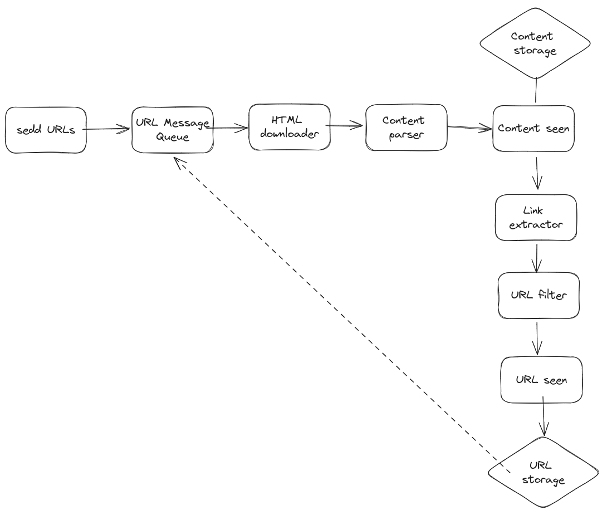

# WEBCRAWLER    

## Description
A webcrawler (robot) that will crawl a list of websites and saves metadata in a database and html content on disk, then recursively crawls all the links found on the pages.

## Diagram 




# Installation

Run postgres database using postgresql 

```bash
$ docker run --name some-postgres -e POSTGRES_PASSWORD=1111 -e POSTGRES_DB=webcrawler -p 5432:5432 -d postgres
```

Run rabbitmq message queue

```bash
$ docker run -it --rm --name rabbitmq -p 5672:5672 -p 15672:15672 rabbitmq:3.12-managemen
``` 

Run go service
    
```bash
$ go run main.go
```


